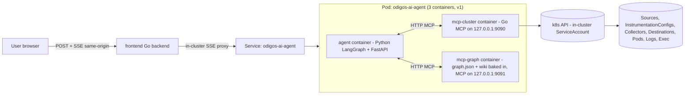
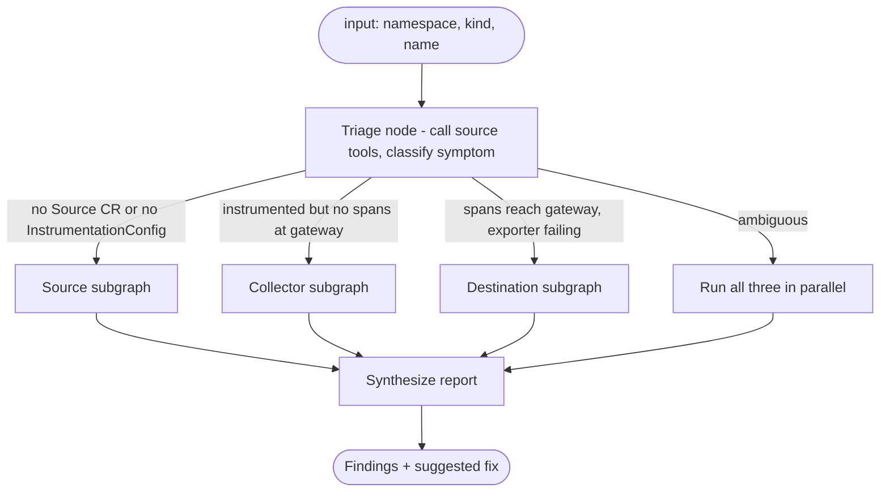
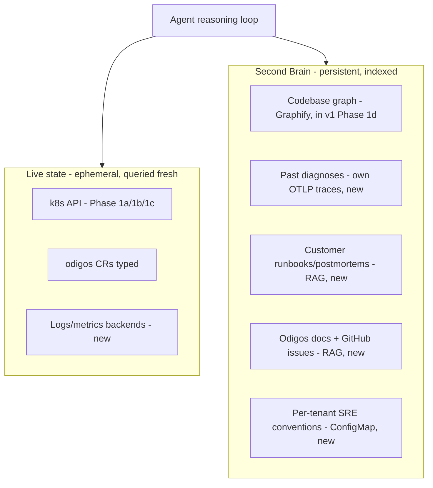

# Odigos AI Agent - Plan

> Build a "Fix with AI" debugging agent that runs in-cluster alongside other odigos components. Triggered from the webapp on a source with missing spans, the agent diagnoses one of three root causes (destination misconfigured, source not instrumented, collector misconfigured) by inspecting cluster state via a Go MCP server, queries a pre-built codebase knowledge graph, and streams its reasoning back to the UI through the existing frontend Go backend.

Canonical plan file: [.cursor/plans/odigos-ai-agent-scaffold_aa1c2042.plan.md](.cursor/plans/odigos-ai-agent-scaffold_aa1c2042.plan.md). This file is the human-readable mirror.

## Phase checklist

- [x] **Phase 0** - Scaffold `odigos-agent/` (mcp/ + graph-mcp/ + agent/), move `graphify-out/` under `graph-mcp/`, three-container docker compose smoke test
- [x] **Phase 1a** - MCP tools for source/instrumentation diagnosis + the single v1 mutation `propose_create_source` / `apply_create_source` (just creates a `Source` CR; richer source-side mutations land in Phase 7)
- [x] **Phase 1b** - MCP tools for collector diagnosis
- [x] **Phase 1c** - MCP tools for destination diagnosis
- [x] **Phase 1d** - graph-mcp tools over bundled `graphify-out/` + minimal `gh_read_file` for citations
- [ ] **Phase 2** - LangGraph diagnostic workflow with three subgraphs and structured findings
- [ ] **Phase 3** - Agent HTTP API with SSE streaming + approval endpoint
- [ ] **Phase 4** - Containerize, RBAC, k8s manifests / Helm subchart, deploy to `odigos-system`
- [ ] **Phase 5** - "Fix with AI" button + Go backend SSE proxy in `frontend/`
- [ ] **Phase 6** - End-to-end validation against broken kind cluster, prompt refinement
- [ ] **Phase 7** - Source instrumentation overrides (distro/SDK selection, OBI enablement) - first post-v1 expansion of the mutation surface
- [ ] **Phase 8+** - Second Brain (forward-looking, see appendix)

## High-level architecture

Everything runs inside the cluster. Webapp never talks to the agent directly - all traffic goes through the existing frontend Go backend, same origin, same auth. Three sidecar containers in the agent pod: the Python agent, the Go MCP for cluster state, and a Python MCP for the codebase knowledge graph.



## Folder layout (top-level, isolated from upstream odigos)

```
odigos-agent/
  docs/
    README.md
    PLAN.md
    PROGRESS.md
    DECISIONS.md
  mcp/                     # Go MCP server (its own image)
    Dockerfile
    go.mod
    main.go
    server/server.go       # HTTP MCP transport, listens on 127.0.0.1:9090 by default
    tools/
      common.go            # k8s clients (in-cluster config), odigos typed clients
      source.go            # phase 1a
      collector.go         # phase 1b
      destination.go       # phase 1c
      citation.go          # phase 1d - minimal gh_read_file for citation expansion only
  agent/                   # Python LangGraph + API (its own image)
    Dockerfile
    pyproject.toml
    src/odigos_agent/
      mcp_client.py        # phase 0 - HTTP MCP client(s) - cluster + graph
      prompts.py           # phase 2
      graph.py             # phase 2
      api.py               # phase 3 - FastAPI + SSE on :8765
      events.py            # phase 3 - step event schema
      cli.py               # phase 0/2 - dev one-shot
  graph-mcp/               # Python MCP server for the codebase graph (its own image)
    Dockerfile             # bakes in ../graphify-out/ at build time
    pyproject.toml
    src/graph_mcp/
      server.py            # MCP HTTP on 127.0.0.1:9091
      loader.py            # loads merged-graph.json + wiki/ at startup
      tools.py             # graph_query, graph_neighbors, graph_path, graph_community, graph_god_nodes, graph_list_communities, wiki_read, graph_metadata
  graphify-out/            # ALREADY EXISTS - pre-built artifact, baked into graph-mcp image
    graph.json
    merged-graph.json
    GRAPH_REPORT.md
    wiki/
  deploy/
    helm/odigos-ai-agent/  # subchart packaged into the main odigos chart later
      Chart.yaml
      values.yaml
      templates/
        deployment.yaml    # 3 containers: agent + mcp-cluster + mcp-graph
        service.yaml
        serviceaccount.yaml
        clusterrole.yaml
        clusterrolebinding.yaml
        secret-anthropic.yaml  # only when value provided
        configmap.yaml
    raw/                   # plain manifests for dev install via kubectl apply -k
      kustomization.yaml
      *.yaml
```

Note on codebase access: the agent does NOT browse the codebase live. The pre-built knowledge graph at [graphify-out/](graphify-out/) (built with [Graphify](https://graphify.net/), commit `37cf1aee`, 7295 nodes / 15191 edges / 497 communities / 508 wiki pages) is baked into the `mcp-graph` container image at build time. The agent queries communities, neighbors, paths, "god nodes", and reads wiki pages. Raw file content is fetched only for final-report citations via a single minimal `gh_read_file(path, lineRange)` tool. This is the codebase half of the broader "Second Brain" architecture (Phase 7+).

## Three failure modes the agent must distinguish

| Mode                      | Symptom                                                   | Primary signals                                                                                                                          |
| ------------------------- | --------------------------------------------------------- | ---------------------------------------------------------------------------------------------------------------------------------------- |
| Destination misconfigured | Spans reach gateway but exporter fails                    | `Destination` CR, gateway exporter block in ConfigMap, gateway logs filtered by destination, exporter metrics                            |
| Source not instrumented   | No telemetry from workload                                | `Source` CR, `InstrumentationConfig`, `InstrumentationInstance`, pod env, odiglet logs on the workload's node, instrumentation rules     |
| Collector misconfigured   | Source instrumented but no spans land at gateway exporter | `CollectorsGroup`, gateway+node ConfigMaps, collector logs, restart counts, otelcol receiver/processor metrics, `Processor`/`Action` CRs |

CRD types live under [api/odigos/v1alpha1](api/odigos/v1alpha1). MCP imports them directly via go.mod replace.

---

## Phase 0 - Scaffold and ping (single chat)

Goal: empty runnable skeleton, all three containers run locally with docker compose, agent talks to both MCPs over HTTP and lists tools.

- Create folder layout above.
- Seed docs: `README.md`, `PLAN.md` (link to this plan), empty `PROGRESS.md`, `DECISIONS.md` with first ADRs:
  - Go for cluster MCP, Python LangGraph for agent, Python for graph MCP.
  - Sidecar pattern, MCP via HTTP on localhost (not stdio) - clean container separation.
  - Frontend integration via Go backend SSE proxy (not direct webapp -> agent).
  - Codebase access via baked-in Graphify artifact + minimal `gh_read_file` for citations.
  - Graphify artifact `graphify-out/` committed in-repo for v1 (immutable per release).
- `mcp/` (cluster MCP): init Go module `github.com/odigos-io/odigos-agent/mcp`. Add `mark3labs/mcp-go` (HTTP transport). `main.go` boots HTTP MCP on `127.0.0.1:9090` with stub tool `ping`. Distroless `Dockerfile`.
- `graph-mcp/` (graph MCP): Python project with `mcp` SDK + `networkx`. `loader.py` reads `merged-graph.json` + walks `wiki/` into a dict at startup. `tools.py` exposes `ping` + `graph_metadata` for v0 smoke. `Dockerfile` COPYs `../graphify-out/` into `/graph` at build, listens on `127.0.0.1:9091`.
- `agent/`: `pyproject.toml` with `langgraph`, `langchain-mcp-adapters`, `langchain-anthropic`, `fastapi`, `uvicorn`, `sse-starlette`, `httpx`, `python-dotenv`. `mcp_client.py` connects to BOTH `MCP_CLUSTER_URL` (`http://127.0.0.1:9090`) and `MCP_GRAPH_URL` (`http://127.0.0.1:9091`), merges tool catalogs. `cli.py` runs trivial ReAct loop. Slim `Dockerfile`.
- Local dev compose file brings all three containers up.
- Smoke test: `docker compose up`, then `python -m odigos_agent.cli "call ping on both MCPs and report graph commit"` returns ping responses + the commit `37cf1aee`.

Exit criteria: all three containers build, agent reaches both MCPs on localhost over HTTP, ping round-trips, `graph_metadata()` returns the bundled commit hash.

---

## Phase 1a - Source / instrumentation MCP tools (single chat)

Goal: every tool the agent needs to decide "is this workload actually being instrumented?".

`mcp/tools/source.go`:

- `get_source(namespace, kind, name)` - returns the `Source` CR (from [api/odigos/v1alpha1/source_types.go](api/odigos/v1alpha1/source_types.go)) plus the namespace-level `Source` if present.
- `get_instrumentation_config(namespace, workload_name, kind)` - reads `InstrumentationConfig`.
- `list_instrumentation_instances(namespace, workload_name)` - per-pod runtime instrumentation status.
- `get_workload(namespace, kind, name)` - underlying Deployment/StatefulSet/DaemonSet pod template (env, volumes, init containers, device requests).
- `list_workload_pods(namespace, kind, name)` - pod statuses, restart counts, container statuses.
- `get_pod_env(namespace, pod, container)` - resolved env including device-injected vars.
- `get_odiglet_logs_for_node(node, tail=200, since=...)` - filter odiglet DaemonSet logs.
- `list_instrumentation_rules()` - to detect rules excluding the workload.

Mutation tools (gated, v1's only writes - see "Approval protocol" in Cross-cutting decisions):

- `propose_create_source(namespace, workload_kind, workload_name)` - server-side dry-run create of a `Source` CR for the workload. Returns `{request_id, yaml, diff, rollback_command}`. Caches the validated request keyed by `request_id` with 5-minute TTL.
- `apply_create_source(request_id)` - lookup cached request, re-validate, apply for real. Errors if request not found, expired, or content mismatch. Emits OTLP audit event.

`tools/common.go` sets up in-cluster client (`rest.InClusterConfig`) with kubeconfig fallback for local dev. Approval cache lives here as a thread-safe map.

Exit criteria: from CLI inside the agent container, the LLM can correctly answer "is workload X instrumented? why or why not?". The `propose_create_source` tool returns valid YAML + diff; the `apply_create_source` tool actually creates the CR when called with a fresh request_id.

---

## Phase 1b - Collector MCP tools (single chat)

`mcp/tools/collector.go`:

- `get_collectors_group(role)` - role = `CLUSTER_GATEWAY` or `NODE_COLLECTOR`.
- `get_collector_config(role)` - reads the rendered ConfigMap (`odigos-gateway`, `odigos-data-collection`), returns parsed YAML pipelines.
- `list_collector_pods(role)` - status, restart count, ready, last termination reason.
- `get_collector_logs(role, pod?, tail=200, since=..., grep?)` - logs with optional regex filter.
- `get_collector_metrics(role, pod?)` - exec `wget -qO- localhost:8888/metrics` inside the collector pod via the k8s exec subresource (no port-forward needed in-cluster). Parse and return `otelcol_receiver_accepted_spans`, `otelcol_receiver_refused_spans`, `otelcol_processor_dropped_spans`, `otelcol_exporter_sent_spans`, `otelcol_exporter_send_failed_spans`.
- `get_processors()` and `get_actions()` - `Processor` and `Action` CRs.

Exit criteria: agent can answer "are spans flowing through node collector and gateway? where do they drop?".

---

## Phase 1c - Destination MCP tools (single chat)

`mcp/tools/destination.go`:

- `list_destinations()` and `get_destination(namespace, name)` - `Destination` CR including `spec.data` and the name of `spec.secretRef`.
- `inspect_destination_secret(namespace, name)` - returns key names + lengths + `looks_empty` boolean per key. Never returns raw values.
- `get_destination_config_in_gateway(destination_name)` - extract the exporter block this destination produced inside the gateway ConfigMap.
- `get_gateway_export_errors(destination_name, tail=500)` - filter gateway logs for exporter + destination name + `error|failed|refused|429|401|403|timeout`.
- `probe_destination_endpoint(destination_name)` - exec a TCP/TLS connect probe (e.g. `nc -zv` in a debug-capable image, or pure-Go probe from the MCP container) against the resolved endpoint. No auth headers sent. Read-only.

Exit criteria: agent can answer "is the destination receiving our spans? if not, network or auth or schema issue?".

---

## Phase 1d - Codebase knowledge graph via Graphify (single chat)

Goal: wire the agent to a pre-built, queryable knowledge graph of the odigos codebase so it reasons about **relationships and design**, not raw text. The graph already exists locally at [graphify-out/](graphify-out/) - 7295 nodes, 15191 edges, 497 communities, 508 wiki MD pages, built from odigos commit `37cf1aee`. v1 ships this artifact as-is; CI rebuild per odigos release is a v2 concern.

### Existing artifacts (already produced, do not rebuild for v1)

- [graphify-out/graph.json](graphify-out/graph.json) - main NetworkX graph (~7.4 MB)
- [graphify-out/merged-graph.json](graphify-out/merged-graph.json) - merged cross-corpus graph (~8.9 MB) - the one the MCP serves (richer, includes doc/wiki nodes)
- [graphify-out/GRAPH_REPORT.md](graphify-out/GRAPH_REPORT.md) - 106 KB audit with all 497 community names + summaries; loaded once into MCP memory for navigation
- [graphify-out/wiki/](graphify-out/wiki/) - 508 markdown pages, one per community/concept (e.g. `InstrumentationConfig_CRD.md`, `Instrumentor_Reconcilers.md`, `Frontend_Source_CRUD.md`, `Pod_Webhook_Env_Injector.md`, `Frontend_Destination_Connection_Test.md`). Each has Key Concepts (file paths + connection counts), Relationships, Source Files, Audit Trail. First-class knowledge - agent reads them directly.

### Why a graph + wiki instead of live grep/RAG

- Captures relationships ("controller A writes status that controller B reads") that grep cannot see.
- Community names already domain-meaningful - perfect entry points for diagnosis.
- Wiki summaries give human-readable per-concept docs - lower token cost than reading source.
- Token-efficient: BFS subgraph queries ~2k tokens vs ~670k for raw-file approaches.
- Works airgapped, no GitHub egress at query time.

### Runtime sidecar (in `odigos-ai-agent` pod)

- `mcp-graph` container: small Python service that loads `merged-graph.json` + the wiki directory at startup and exposes MCP HTTP on `127.0.0.1:9091`. NOT `graphify serve` - we control the MCP surface explicitly so we can shape tool semantics for the diagnostic use case (filter by community, return wiki content alongside nodes, etc.).
- v1 packaging: bake [graphify-out/](graphify-out/) into the `mcp-graph` container image at build time. Single immutable artifact per agent release. No init container needed.
- v2 packaging (deferred): pull a versioned OCI artifact at startup via `oras` init container, matching the installed odigos version. Same approach as previously planned. v1 doesn't need it since the graph already exists in-repo.

### MCP tools exposed by `mcp-graph`

- `graph_query(query, kind?)` - semantic+lexical node search across `label` and `norm_label`; returns top-k nodes with `{id, label, file, line, community_id, community_name, kind}`. `kind` filter: `code`, `concept`, `doc`.
- `graph_neighbors(node_id, depth=1)` - immediate or 2-hop neighbors; reveals what a node interacts with.
- `graph_path(from_id, to_id, max_hops=4)` - shortest path; reveals "how does X reach Y?".
- `graph_community(community_id_or_name)` - returns nodes in the community + the wiki page.
- `graph_god_nodes(topK=20, scope?)` - highest-degree nodes overall or scoped to a community.
- `graph_list_communities(filter?)` - all 497 community names with node counts; lets the agent browse by domain (e.g. filter `Instrument`, `Destination`, `Collector`).
- `wiki_read(community_name)` - returns the full wiki MD page (already chunked, hundreds of lines max).
- `graph_metadata()` - returns pinned odigos commit (`37cf1aee` for v1's bundled graph), build date, node/edge/community counts.

### Single citation-expansion tool in the Go MCP (`mcp/tools/citation.go`)

- `gh_read_file(path, line_start, line_end)` - fetch raw from `raw.githubusercontent.com/odigos-io/odigos/<pinned_commit>/<path>`. Hard cap 200 lines. Used only after the agent has path+range from a graph node. NOT for exploration.
- Pinned commit comes from `graph_metadata().commit` - keeps citations in sync with the indexed graph.
- LRU cache ~20MB, 30 min TTL. Optional `GITHUB_TOKEN` for rate limits.

### Agent-side prompt rules (added to `prompts.py`)

- "You have a codebase knowledge graph and a wiki. Cluster state first, graph second."
- "Start exploration with `graph_list_communities` filtered by domain (e.g. 'Instrument', 'Destination', 'Collector') to find relevant areas."
- "Read the wiki page (`wiki_read`) before drilling into individual nodes - it summarizes the community's purpose and key concepts."
- "Use `gh_read_file` only to expand a snippet you've already located via the graph, for the final report. Never for exploration."
- "When citing source in the report, include file path + line range from the graph node. UI renders these as links to GitHub at the pinned commit."

### Streaming

- `event: knowledge_query` for `graph_*` and `wiki_read` calls; UI shows "Reading wiki: Instrumentor Reconcilers" or "Querying graph: instrumentation device injection".
- `event: codebase_read` for `gh_read_file` snippet fetches.

### Egress

- v1 with bundled graph: only `raw.githubusercontent.com` for citations. No `ghcr.io` needed (graph baked in).
- Helm value `codebaseGraph.enabled` (default `true`); when `false`, the `mcp-graph` sidecar is omitted entirely.

### Per-session budget

- Max 30 graph/wiki queries + 10 citation reads per `/debug` request.

### Repo hygiene

- [graphify-out/](graphify-out/) currently sits at repo root (this is the upstream odigos clone). For v1 it should move to `odigos-agent/graph-mcp/graphify-out/` so the upstream-isolated layout stays clean and the Docker build context is local.
- Size ~17 MB (graph.json + merged-graph.json + wiki/). Options: commit as-is, Git LFS, or `.gitignore` + check-in to a release artifacts repo.
- Recommendation: commit as-is under `odigos-agent/graph-mcp/graphify-out/` for v1 (immutable, one-time, simplifies Docker context). Revisit in v2 when the OCI artifact pipeline lands.
- Document the move + the choice in DECISIONS.md.

Exit criteria: agent answers "what does `AppliedInstrumentationDevice` mean and where is it set?" by listing communities matching `Instrument`, reading the `InstrumentationConfig_CRD` wiki, calling `graph_neighbors` on the controller node, then pulling a 20-line snippet via `gh_read_file` for the final report citation.

---

## Phase 2 - LangGraph diagnostic workflow (single chat)

`agent/src/odigos_agent/graph.py` and `prompts.py`.



- Each subgraph is a small ReAct loop bound only to its domain's MCP tools.
- `state` TypedDict: `input_workload`, `triage`, `source_findings`, `collector_findings`, `destination_findings`, `report`, `step_log`.
- Each node appends to `step_log` entries like `{"phase":"triage","action":"checking InstrumentationConfig odigos-system/payments","ts":...}` for phase 3 streaming.
- Final `Report`:

```
Report: {
  root_cause: "destination_misconfigured" | "source_not_instrumented" | "collector_misconfigured" | "unknown",
  confidence: 0..1,
  evidence: [str, ...],
  suggested_actions: [str, ...],     # text suggestions (kubectl commands, UI steps)
  proposed_remediation: null | {     # only when v1 mutation applies (root_cause = source_not_instrumented missing Source CR)
    op: "create_source",
    request_id: str,
    yaml: str,
    diff: str,
    rollback_command: str,
    status: "pending_approval" | "approved_applied" | "denied" | "timed_out" | "failed",
    result: null | str
  }
}
```

- Source subgraph node logic: if it determines the workload needs a `Source` CR, it calls `propose_create_source`, attaches the result to `state.proposed_remediation` with status `pending_approval`, then yields control back to the API layer to await user decision. After decision arrives, it calls `apply_create_source` (or skips on deny) and updates `status` + `result`.
- CLI: `uv run odigos-agent debug --namespace foo --kind Deployment --name payments`.

Exit criteria: against a deliberately broken workload in kind, the right subgraph fires and produces a sensible report.

---

## Phase 3 - Agent HTTP API with SSE (single chat)

`agent/src/odigos_agent/api.py` + `events.py` + `approvals.py`.

- FastAPI on `:8765`. Endpoints:
  - `POST /debug` body `{namespace, kind, name}` -> SSE stream. Generates a `debug_session_id`.
  - `POST /approve/{debug_session_id}/{request_id}` body `{decision: "approve"|"deny"}` -> 204. Wakes the waiting agent loop via an in-memory `asyncio.Event` keyed by `(debug_session_id, request_id)`.
- Drive events from `langgraph`'s `astream_events` plus the explicit `step_log` and approval appends.
- Event schema:

```
event: session            data: {"debug_session_id": "..."}
event: step               data: {"phase":"source","message":"Reading InstrumentationConfig payments","ts":...}
event: knowledge_query    data: {"phase":"source","query":"InstrumentationConfig controller"}
event: codebase_read      data: {"path":"instrumentor/controllers/foo.go","lines":"120-160"}
event: finding            data: {"phase":"source","summary":"InstrumentationConfig missing"}
event: approval_required  data: {"request_id":"...","op":"create_source","yaml":"...","diff":"...","rollback_command":"..."}
event: approval_resolved  data: {"request_id":"...","decision":"approve","result":"created"}
event: report             data: {<full Report JSON>}
event: done               data: {}
```

- Approval handling: source subgraph emits `approval_required`, agent loop awaits `approvals.wait(debug_session_id, request_id, timeout=300s)`. UI POSTs to `/approve/...`, handler sets the event with the decision, agent resumes. On timeout, decision = `timed_out` and execution skips the apply.
- Auth: shared bearer token from env `ODIGOS_AGENT_TOKEN`, injected by deployment. Frontend backend supplies it. No CORS needed (only the in-cluster Go backend calls this).
- Health endpoints `/healthz`, `/readyz` for k8s probes.

Exit criteria: from inside the cluster, `curl -N -H "Authorization: Bearer $TOK" -d '{"namespace":"default","kind":"Deployment","name":"payments"}' http://odigos-ai-agent.odigos-system:8765/debug` streams steps then a final report.

---

## Phase 4 - Containerize and deploy (single chat, may split if Helm gets heavy)

Goal: `helm install` (or `kubectl apply -k`) drops the agent into `odigos-system` next to other components.

### Images

- `odigos-ai-agent-mcp` from `odigos-agent/mcp/Dockerfile` - distroless Go.
- `odigos-ai-agent` from `odigos-agent/agent/Dockerfile` - python:3.12-slim, non-root.
- `odigos-ai-agent-graph` from `odigos-agent/graph-mcp/Dockerfile` - python:3.12-slim, COPYs [graphify-out/](graphify-out/) into `/graph` at build time; entrypoint `python -m graph_mcp.server --graph /graph/merged-graph.json --wiki /graph/wiki --port 9091`.
- v2: external `odigos-codebase-graph:v1.X.Y` OCI artifact pulled by init container, matching installed odigos version. Not in v1.

### k8s objects (in `deploy/helm/odigos-ai-agent/templates/`)

- `serviceaccount.yaml` - `odigos-ai-agent` SA in `odigos-system`.
- `clusterrole.yaml` - mostly read-only:
  - `odigos.io` group: `sources`, `instrumentationconfigs`, `instrumentationinstances`, `instrumentationrules`, `destinations`, `collectorsgroups`, `processors`, `actions` - `get/list/watch`.
  - `odigos.io/sources` - `create` (v1's only mutation, gated by user approval at runtime).
  - core: `pods`, `configmaps`, `services`, `namespaces`, `nodes`, `secrets` (only `secrets` `get` for destination secret key inspection - consider scoping by name/label later) - `get/list`.
  - `apps`: `deployments`, `statefulsets`, `daemonsets` - `get/list`.
  - `pods/log` - `get`.
  - `pods/exec` - `create` (needed for collector metrics scrape and destination probe).
- `clusterrolebinding.yaml` - bind to SA.
- `secret-anthropic.yaml` - only rendered when `anthropicApiKey` value provided; otherwise references existing secret name from values. Referenced as env in deployment.
- `secret-github.yaml` - optional `GITHUB_TOKEN` for higher GitHub API rate limits (Phase 1d). Same pattern as anthropic secret. Omit entirely if `codebaseAccess.enabled=false` or no token provided.
- `configmap.yaml` - non-secret config: `MCP_CLUSTER_URL`, `MCP_GRAPH_URL`, `ODIGOS_AGENT_MODEL`, `LOG_LEVEL`.
- `deployment.yaml` - one replica, three sidecar containers (no init container in v1):
  - `mcp-cluster` container: `odigos-ai-agent-mcp:<tag>`, listens on `127.0.0.1:9090` only, no service port.
  - `mcp-graph` container: `odigos-ai-agent-graph:<tag>`, listens on `127.0.0.1:9091` only. Graph + wiki baked into the image. Skipped if `codebaseGraph.enabled=false`.
  - `agent` container: `odigos-ai-agent:<tag>`, env from configmap + secret (`MCP_CLUSTER_URL=http://127.0.0.1:9090`, `MCP_GRAPH_URL=http://127.0.0.1:9091`), exposes `8765`, probes on `/healthz`/`/readyz`.
  - SecurityContext: non-root, readOnlyRootFilesystem where possible.
  - v2: add init container `graph-puller` that `oras pull`s a version-pinned graph into shared `emptyDir`. Out of scope for v1.
- `service.yaml` - ClusterIP `odigos-ai-agent.odigos-system:8765` -> agent container.

### values.yaml highlights

```yaml
image:
  mcpCluster: { repository: ..., tag: ... }
  mcpGraph:   { repository: ..., tag: ... }
  agent:      { repository: ..., tag: ... }
anthropic:
  apiKey: ""              # if set, helm creates secret; otherwise:
  existingSecret: ""
  existingSecretKey: ANTHROPIC_API_KEY
agentToken:
  value: ""               # consumed by frontend Go backend too
github:
  token: ""               # optional, for higher GitHub raw API rate limits (citation tool)
codebaseGraph:
  enabled: true
  # v1: graph baked into mcp-graph image; v2 unlocks these for OCI artifact pull
  # artifactBase: "ghcr.io/odigos-io/odigos-codebase-graph"
  # fallbackVersion: "v1.21.0"
model: "claude-sonnet-4-..."
resources: { ... }
```

### Dev install path

- `deploy/raw/` with `kustomization.yaml` for `kubectl apply -k deploy/raw` so devs without helm can iterate.

Exit criteria: `helm install odigos-ai-agent ./deploy/helm/odigos-ai-agent -n odigos-system` brings up a healthy pod, `kubectl exec` into the agent and `curl http://127.0.0.1:9090` reaches MCP, `curl http://odigos-ai-agent:8765/healthz` returns 200.

---

## Phase 5 - Frontend integration: Go backend proxy + UI (single chat, may split UI vs backend)

### 5a - Go backend SSE proxy

- Add a REST handler in [frontend/main.go](frontend/main.go) (or a new file alongside it) at `POST /api/ai/debug`.
- Handler:
  - Reads body `{namespace, kind, name}`.
  - Opens `POST http://odigos-ai-agent.odigos-system:8765/debug` with `Authorization: Bearer $ODIGOS_AGENT_TOKEN`.
  - Streams response bytes through to the client with `Content-Type: text/event-stream`, flushing on each chunk (`http.Flusher`).
  - Aborts upstream on client disconnect.
- Config from existing config patterns: `AI_AGENT_URL`, `AI_AGENT_TOKEN` env vars, surfaced via the existing config struct.
- No GraphQL change - GraphQL doesn't suit streaming. REST + SSE is the simple right tool.

### 5b - Webapp UI

- Locate the source detail view in `frontend/webapp/containers/...` (find via `grep` for "Source" route components in phase 5 chat).
- Add `<FixWithAIButton>` next to existing actions on a source row/detail.
- New `frontend/webapp/lib/aiAgent.ts` opens `fetch('/api/ai/debug', { method:'POST', body, headers })` and reads the SSE stream via `ReadableStream` reader (works in modern browsers; `EventSource` doesn't support POST).
- New `<AgentDiagnosticsPanel>` side panel:
  - Live "currently doing X" header (latest `step` event message).
  - Collapsible step log (with sub-types: tool, knowledge_query, codebase_read).
  - **Approval modal** triggered by `approval_required` event:
    - Shows op name (e.g. "Create Source CR").
    - Shows YAML in a syntax-highlighted block with the diff highlighted.
    - Shows rollback command in a copyable code block.
    - Approve / Deny buttons. On click, POSTs to `/api/ai/approve/{debug_session_id}/{request_id}`.
    - Auto-deny after 5 minutes with countdown shown.
  - Final report card: root cause badge, confidence, evidence list, suggested actions list, applied remediation status (created / denied / timed_out / failed) with rollback command if applied.
  - Cancel button aborts the fetch and any pending approval.

### 5c - Approval proxy in Go backend

- Add `POST /api/ai/approve/{session}/{request_id}` handler in `frontend/main.go`.
- Forwards body to `POST http://odigos-ai-agent.odigos-system:8765/approve/{session}/{request_id}` with the bearer token.
- Logs approve/deny decisions to the Go backend's audit log alongside other UI actions.

Exit criteria: clicking "Fix with AI" on a workload missing its `Source` CR streams diagnosis, shows the approval modal with the proposed YAML, and on Approve actually creates the CR. On Deny, the report shows the suggestion as text only.

---

## Phase 6 - End-to-end validation and prompt tuning (single chat)

> **Deferred from Phase 1**: Each subphase commit only runs build + unit tests,
> not a kind-cluster smoke test. Phase 6 is where every Phase 1 tool gets
> exercised against a real cluster: `kubectl apply` the dev manifests (or
> install the Helm subchart once Phase 4 lands), `kubectl exec` into the MCP
> pod, `curl` the `/mcp` endpoint, and assert each tool returns plausible
> structured JSON against a real workload, CollectorsGroup, Destination, and
> the bundled graph. Then exercise `propose_create_source` ->
> `apply_create_source` end-to-end on a deliberately uninstrumented workload.
> This is the network-path validation that Phase 1's pure-build checks
> intentionally skip.

- Use the kind setup from the workspace rule. Install demo workloads.
- Reproduce each failure mode:
  - Misconfigure a destination (bad endpoint or empty token in its secret).
  - Remove a `Source` CR for a workload that previously had one.
  - Inject a broken processor into the gateway ConfigMap.
- For each, click "Fix with AI" and confirm correct root cause + actionable suggestion.
- For the "missing Source CR" case specifically: confirm the approval modal appears with valid YAML, Approve actually creates the CR, Deny leaves cluster untouched, timeout works.
- Tune `prompts.py` based on failures. Log iterations in `docs/PROGRESS.md`.
- Add a few golden snapshot tests under `agent/tests/` if time permits.

Exit criteria: 3/3 failure modes correctly diagnosed twice in a row, approval flow works end-to-end (approve creates CR, deny doesn't).

---

## Phase 7 - Source instrumentation overrides: distro/SDK selection + OBI enablement (single chat, may split)

Goal: extend the source remediation surface beyond `create_source`. v1's mutation only covers "no `Source` CR exists, create one." This phase handles the case where the workload already has a `Source` but is being instrumented incorrectly - wrong distro/SDK for the language (most relevant for Java with multiple distros available), or where eBPF-based OBI instrumentation should be enabled instead of (or alongside) the language-native SDK.

This is the first post-v1 expansion of the mutation surface and exercises the approval framework with multiple op types. It's a concrete down-payment on the broader "Mutation expansion + batch-plan approval" component in the Phase 8+ Second Brain appendix - same approval/audit/RBAC discipline, but still single-op-per-session like v1.

### Triggers the agent must distinguish

- Workload is instrumented (Source + InstrumentationConfig present, InstrumentationInstances reporting) but spans are wrong/missing because the wrong distro was auto-selected (e.g. Java workload using a JDK or framework where the default distro doesn't capture what the user wants).
- Workload is instrumented but the language SDK can't attach (closed-source runtime, statically-linked binary, unsupported runtime version) - OBI would succeed where the SDK can't.
- User wants to switch a workload from SDK-based to OBI-based instrumentation (or vice versa) for cost / overhead / coverage reasons.

### New MCP tools (extend `mcp/tools/source.go` or new `mcp/tools/instrumentation.go`)

Read-only:

- `list_available_distros(language?)` - enumerate distros available in this odigos installation per language, with their metadata (name, description, signals supported, runtime requirements). Sourced from whatever in-cluster registry odigos already exposes (likely an embedded list in the instrumentor or a ConfigMap).
- `get_workload_distro(namespace, kind, name)` - resolve the distro currently applied to the workload by walking `InstrumentationConfig` + matching `InstrumentationRule`s + odigos defaults. Returns `{language, distro_name, source: "default"|"rule:<name>"|"source-cr"}` so the agent can explain *why* this distro was chosen.
- `check_obi_eligibility(namespace, kind, name)` - report whether OBI can attach to this workload: kernel version on the node, runtime / language detection, known incompatibility flags. Returns `{eligible: bool, reasons: [str, ...]}`.

Mutations (same `propose_X` / `apply_X` request-id pattern as Phase 1a):

- `propose_override_distro(namespace, kind, name, distro_name)` - server-side dry-run patch of the relevant `InstrumentationRule` (or create one scoped to this workload) selecting the new distro. Returns `{request_id, yaml_before, yaml_after, diff, rollback_command}`.
- `apply_override_distro(request_id)` - cached re-validate + apply.
- `propose_enable_obi(namespace, kind, name)` - server-side dry-run create/patch of the `InstrumentationRule`(s) needed to enable OBI for the workload, plus any Source-side spec changes required. Returns same shape.
- `apply_enable_obi(request_id)` - cached re-validate + apply.
- `propose_disable_obi(namespace, kind, name)` / `apply_disable_obi(request_id)` - symmetric rollback path for OBI (separate from the `rollback_command` text, since reverting OBI may require multiple CR edits).

All mutations emit OTLP audit events tagged with `op`, same as Phase 1a.

### LangGraph updates

- Source subgraph gains a **remediation decision** node downstream of the diagnosis. Inputs: current findings, `get_workload_distro` result, `check_obi_eligibility` result, available distros for the language. Output: choice of `create_source` | `override_distro` | `enable_obi` | `disable_obi` | `text_only_suggestion`.
- `Report.proposed_remediation` schema extends to:

```
proposed_remediation: null | {
  op: "create_source" | "override_distro" | "enable_obi" | "disable_obi",
  request_id: str,
  # per-op payload:
  yaml: str,                    # for create_source (greenfield)
  yaml_before: str,             # for override_distro / enable_obi / disable_obi
  yaml_after: str,              # for override_distro / enable_obi / disable_obi
  diff: str,
  rollback_command: str,
  status: "pending_approval" | "approved_applied" | "denied" | "timed_out" | "failed",
  result: null | str,
  # op-specific context for the UI:
  context: { ... }              # e.g. {"language":"java","from_distro":"java-otel","to_distro":"java-otel-musl"} or {"obi_eligibility_reasons":[...]}
}
```

- Still single-op-per-session. Multi-op batch plan stays in Phase 8+.

### RBAC widening

- `odigos.io` group: `instrumentationrules` - `create`, `update`, `patch` (was `get/list/watch` only in v1).
- `odigos.io` group: `sources` - extend from `create` to `update`/`patch` if `enable_obi` requires Source-side spec changes (confirm during implementation - if Source spec is untouched, leave at `create`).
- Each new verb added is a deliberate ADR in `DECISIONS.md`. Don't widen preemptively.

### Approval framework reuse

- Cache TTL, request-id re-validation, dry-run-then-apply pattern from Phase 1a all unchanged.
- Per-session mutation cap stays at 1 (single-op model). Lifting it to N approved ops in a planned batch is Phase 8+ work (Second Brain component 0).

### UI updates (extends Phase 5)

- Approval modal generalizes to render any of the supported op types:
  - `create_source`: existing greenfield YAML view.
  - `override_distro`: side-by-side or unified diff of the `InstrumentationRule` before/after, with the distro change highlighted; a one-line callout naming the old and new distro.
  - `enable_obi` / `disable_obi`: same diff view, plus a callout explaining what OBI is and what changes (e.g. "Workload will be re-instrumented via eBPF; restart may be required").
- Approve/Deny buttons, 5-minute auto-deny, rollback-command display - all unchanged.
- Step-event types unchanged; only the `approval_required` payload grows.

### Streaming

- New `event: approval_required` payload includes `op` and the op-specific context block so the UI can pick the right modal layout without inferring from yaml shape.

### Exit criteria

- Java workload deliberately instrumented with a default distro that doesn't fit (e.g. an app using a framework the default distro doesn't cover well): agent diagnoses the mismatch, proposes `override_distro` with the right distro from the available list, approval modal shows the `InstrumentationRule` diff, Approve actually patches the rule and re-instrumentation kicks in. Deny leaves the cluster untouched.
- Workload where the language SDK can't attach (statically-linked Go binary, or a runtime version outside the SDK's support matrix): agent diagnoses the SDK failure, calls `check_obi_eligibility`, proposes `enable_obi`, approval flow works end-to-end and spans start flowing via OBI.
- All mutations produce valid OTLP audit events; rollback commands work when run manually.

---

## Cross-cutting decisions

- **Read-mostly with one gated mutation in v1.** Diagnostic tools all read-only. Exactly one mutation tool exposed in v1: `create_source` (instrument a workload by creating its `Source` CR). All other remediation surfaces as text suggestions in the report. Future phases unlock more mutations under the same approval framework.
- **Approval protocol** (v1, single-op variant of the future batch-plan flow):
  1. Agent decides remediation requires `create_source`.
  2. Agent calls `propose_create_source(namespace, kind, name)` - MCP runs `--dry-run=server`, returns the resulting YAML + diff.
  3. SSE emits `event: approval_required` with `{request_id, op: "create_source", yaml, diff, rollback_hint}`.
  4. Agent reasoning loop pauses, waits on approval store.
  5. UI shows diff, user clicks Approve/Deny, frontend POSTs `/approve/{request_id}` with decision.
  6. On Approve: agent calls `apply_create_source(request_id)` - MCP re-validates request_id matches the dry-run, applies for real.
  7. On Deny or 5-minute timeout: agent records the rejection and continues with the report.
- **Audit**: every mutation logged (caller user, timestamp, request_id, dry-run yaml, applied yaml, result). Sent over OTLP via the same odigos pipeline (dogfooding).
- **Reversibility**: every mutation tool returns a `rollback_command` field (e.g. `kubectl delete source.odigos.io X -n Y`). Surfaced in the report.
- **Scope**: trust the approval gate. RBAC scoped to what the v1 mutation needs (create `sources.odigos.io`). When future mutations land, RBAC widens at that point, not preemptively.
- **Per-session budget**: max 1 mutation per `/debug` in v1 (since only one op exists). Future: max N approved ops per session.
- **LLM**: Anthropic Claude via `langchain-anthropic`. Model from `ODIGOS_AGENT_MODEL` env. Key from `ANTHROPIC_API_KEY` mounted from a Secret.
- **Sidecar transport**: MCP HTTP on `127.0.0.1:9090` and `127.0.0.1:9091` inside the pod. Not exposed as Services. Only the agent container in the same pod talks to them. No auth needed between agent and MCPs.
- **Frontend never talks to agent directly**: only the Go backend does. Agent token never leaves the cluster, no CORS surface.
- **Secret hygiene**: destination secrets never returned raw - only key names, lengths, emptiness flag.
- **Output sizing**: all MCP tool outputs JSON-serializable and capped (logs default tail 200, configs trimmed, codebase reads default 200 lines).
- **Codebase access**: pre-built knowledge graph baked into the `mcp-graph` image. Repo-locked to `odigos-io/odigos`. Optional `GITHUB_TOKEN` for citation rate limits. Per-session read budget caps rabbit holes.
- **`docs/PROGRESS.md`** updated at the end of each phase with a one-line dated entry pointing to the chat that did the work.

## Out of scope for v1

- Auto-fix / write actions beyond the single `create_source` op.
- Multi-cluster (central+proxy) - works only against the cluster the agent is deployed in.
- Persistent storage of past diagnoses.
- CI rebuild of the codebase graph per odigos release - v1 ships bundled graph at commit `37cf1aee`.
- Multi-repo codebase access. Locked to `odigos-io/odigos`.
- Logs/metrics backend tools (Loki, Prometheus, Datadog) - see Phase 7+ appendix.
- Customer knowledge RAG (runbooks, wiki, past incidents) - see Phase 7+ appendix.
- PII redaction, data residency controls, per-tenant prompt injection - see Phase 7+ appendix.
- Production auth (mTLS, OIDC) on the agent endpoint - relies on bearer token + ClusterIP-only Service.

---

## Phase 8+ - Second Brain (forward-looking, not v1)

For SRE personas on very large enterprise clusters (10k+ pods, hundreds of namespaces) asking deep technical questions, v1's "live cluster reads + codebase graph" needs to grow into a real **Second Brain**: a set of persistent knowledge stores the agent can draw on, separate from the constantly-changing live state it queries fresh each time. This appendix captures that target architecture so v1 (and the Phase 7 mutation expansion) choices stay compatible.

### The mental model



Agent picks per question. "Why is service X dropping spans intermittently since 14:00?" -> Live (current state + log/metric range) + Brain (similar past diagnosis + runbook entry + relevant code area from graph).

### Why naive "RAG over the cluster" is the wrong frame

- Cluster state changes constantly - re-embedding can't keep up with pod restarts, CR updates.
- "Is pod X running?" is an exact direct-API question, not similarity search.
- Logs are time-series, not documents. Use full-text + time-window backends (Loki/Elastic), not vectors over raw lines.
- "How many workloads have export failures?" is aggregation, not retrieval.

The Second Brain is for **slow-changing knowledge** (codebase, docs, runbooks, past resolutions). Live state stays direct.

### Components

0. **Multi-op batch-plan approval** - generalization of Phase 7's single-op model
   - v1 ships one mutation (`create_source`). Phase 7 adds `override_distro`, `enable_obi`, `disable_obi`, all still single-op-per-session under the same approval framework. Phase 8+ generalizes to a **remediation plan**: ordered list of typed ops (`create_source`, `override_distro`, `enable_obi`, `update_destination_secret`, `patch_instrumentation_rule`, `restart_workload`, `update_collector_configmap`, `restart_collector`, ...).
   - Agent emits the full plan once; UI shows all steps with diffs; user approves the whole plan or rejects individual steps; agent executes in order with abort-on-failure.
   - Each op type:
     - has its own typed `propose_X` / `apply_X` MCP tool pair with server-side dry-run.
     - returns a `rollback_command`.
     - emits OTLP audit event with full before/after.
   - RBAC widens incrementally per op type. Each addition is a deliberate ADR in DECISIONS.md.
   - Higher-risk ops (Secret edits, collector ConfigMap edits) require a stronger approval - second confirmation, or different role.
   - Per-session budget grows with config: default `maxMutations: 5`, hard ceiling `20`.

1. **Codebase knowledge graph** - LANDS IN v1 (Phase 1d via Graphify)
   - v1: bundled `graphify-out/` baked into the `mcp-graph` image, single immutable artifact at commit `37cf1aee`.
   - v2: CI rebuild per odigos release, OCI artifact distribution, init container pulls version-matched graph at startup. Same shape as previously planned, deferred.
   - Future: enrich the Graphify build with linked odigos docs and CRD reference docs so the graph spans code+docs+wiki in one structure.

2. **Observability backend MCP tools** - highest ROI of remaining work, low effort
   - Pluggable `LogsBackend` interface, implementations for Loki, Elasticsearch, Datadog, Splunk, OpenSearch.
   - Tools: `logs_search(query, timeRange, namespace?, pod?)`, `logs_aggregate(query, groupBy, timeRange)`.
   - Same pattern for metrics: `MetricsBackend` (Prometheus/Mimir/Datadog), tools `metric_query`, `metric_query_range`.
   - Configured via Helm values or auto-detected from cluster (detect Loki Service, look for Prometheus Operator CRs).
   - Should land before any further Brain work - most enterprise clusters already have Prometheus+Loki and SREs immediately want them.

3. **Past diagnoses store** - the actual "second brain memory" of the agent
   - Every `/debug` run emits a structured trace (input symptoms, tool calls, findings, final report, user feedback if collected) to a small store.
   - v1 storage: SQLite in a PVC; v2: Postgres or the existing odigos data layer if present.
   - Tool: `find_similar_diagnoses(symptoms, topK)` - embeds the current symptoms, retrieves prior diagnoses with the same root cause class.
   - Tool: `get_diagnosis_outcome(id)` - whether the suggested fix worked (requires user feedback loop on the UI).
   - Powers "we've seen this 3 times before in this cluster, the fix was X" - a killer SRE feature.

4. **Customer knowledge RAG** - highest value for SRE persona
   - Optional `knowledgeSources` Helm value: list of `{type: confluence|github_wiki|s3|gitrepo|notion, ...}`.
   - Indexer CronJob: pulls sources, chunks (markdown-aware), embeds, writes to vector DB.
   - Tool: `knowledge_search(query, topK)` returns chunks with provenance (source URL + author + last-updated).
   - Embedding provider configurable: OpenAI / Cohere / local BGE-large for fully self-hosted enterprises.
   - Vector DB: Qdrant sidecar by default; pgvector option for shops that already run Postgres.

5. **Odigos docs + GitHub issues RAG** - shipped by us, not customer-specific
   - Built in CI alongside the Graphify graph. OCI artifact `ghcr.io/odigos-io/odigos-knowledge:v1.X.Y`.
   - Includes: docs/* in the odigos repo, public GitHub issues + their resolutions, recent release notes.
   - Tool: `odigos_kb_search(query, topK)`.
   - Lets the agent answer "is this a known issue in v1.21?" without us hand-coding rules.

6. **Scoping discipline for large clusters**
   - Every cluster-state tool MUST take a scope: namespace, label selector, or owner reference. No naked `list pods`.
   - `ClusterScope` parameter set early by the triage node ("this debug request is about workload X in namespace Y, scope all subsequent reads").
   - Page-with-cap on every list (default 100, hard max 1000), with `more_available` flag so the agent knows.

7. **Per-tenant context injection**
   - ConfigMap of "customer SRE conventions" (naming rules, on-call escalation, known ignored namespaces, custom severity thresholds) fed into the system prompt.

8. **Caching / memoization**
   - Redis sidecar for cross-session memoization. Hash of (tool, args) -> result with TTL.
   - Big cost reduction during incidents when many SREs hammer similar queries.

9. **Audit + replay**
   - The same OTLP trace that feeds the past-diagnoses store is also a debugging artifact for the agent itself.
   - Trace flows through the customer's odigos pipeline - dogfooding.
   - Replay tool: re-run a past diagnosis with a newer model/prompt to A/B test improvements.

10. **Privacy guardrails (mandatory for enterprise)**
    - PII redaction layer between MCP tool output and LLM prompt (regex + ML-based for emails/IPs/tokens/JWTs).
    - Data residency mode: LLM calls routed to customer-controlled inference (Bedrock, Azure OpenAI, self-hosted vLLM) - one-line LangChain swap.
    - Per-namespace RBAC enforcement in the agent service: caller's k8s identity propagated, agent only reads what the caller can read (token-passthrough or impersonation).
    - Optional: redact Brain entries before persisting to past-diagnoses store.

### v1 design choices that keep this future open

- MCP tool boundary - any future Brain store slots in as additional MCP tools without touching the agent graph.
- Sidecar pattern - extra sidecars (Redis cache, Qdrant, indexer CronJobs) drop in alongside; v1 already runs three sidecars (agent + mcp-cluster + mcp-graph).
- OCI artifact distribution - planned for v2 codebase graph; reuse for docs RAG, knowledge bundles, etc.
- LangChain LLM abstraction - swap providers without touching graph or prompts.
- Step events already structured + streaming - audit trail is mostly free.
- ClusterIP-only Service + bearer token - foundation for proper auth/impersonation later.
- Graphify chosen for codebase precisely because it's a *knowledge graph*, not raw text - it composes naturally with other Brain stores (graph nodes can link to past diagnoses that touched them, to docs sections, etc.) in a future "unified Brain graph" iteration.
