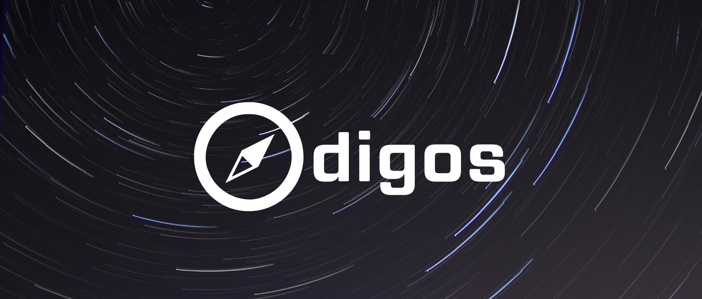

<p align="center">
  
</p>
<h1 align="center">
 Fix Production Issues Faster With Effortless Observability
</h1>

<p align="center">
    <a href="https://github.com/keyval-dev/odigos/actions/workflows/main.yml" target="_blank">
    
    </a>
    <a href="https://goreportcard.com/report/github.com/keyval-dev/odigos/cli" target="_blank">
    
    </a>
    <a href="https://godoc.org/github.com/keyval-dev/odigos/cli" target="_blank">
    
    </a>
</p>

**Get distributed traces, metrics and logs for any application in minutes, without code changes.**

- 🧑‍💻 **No code changes** - Odigos detects the programming language of your applications and apply automatic instrumentation accordingly.
- 📖 **Open technologies** - Applications are instrumented using well-known, battle-tested open source observability technologies such as [OpenTelemetry](https://opentelemetry.io) and [eBPF](https://ebpf.io).
- 🚀 **Boost your existing monitoring tools** - No need for changing tools. Use your favourite tool, with much more data.
- ✨ **Works on any application** - Get automatic distributed traces and metrics even for applications written in Go. Odigos leverage eBPF in a unique way that removes the need to manually instrument even compiled languages.
- 🔭 **Observability by default** -

### For full documentation and getting started guide, visit [odigos.io](https://odigos.io).

## Supported Destinations

### Managed

|               | Traces | Metrics | Logs |
| ------------- | ------ | ------- | ---- |
| New Relic     | ✅     | ✅      | ✅   |
| Datadog       | ✅     | ✅      |      |
| Grafana Cloud | ✅     | ✅      | ✅   |
| Honeycomb     | ✅     |         |      |
| Logz.io       | ✅     | ✅      | ✅   |

### Open Source

|            | Traces | Metrics | Logs |
| ---------- | ------ | ------- | ---- |
| Prometheus |        | ✅      |      |
| Tempo      | ✅     |         |      |
| Loki       |        |         | ✅   |
| Jaeger     | ✅     |         |      |
| SigNoz     | ✅     | ✅      | ✅   |

**Many more destinations are coming soon.**

Can't find the destination you need? Help us by following our quick [adding new destination](https://odigos.io/docs/contribution-guidelines/add-new-destination/) guide and submit a PR.

## Installation

The easiest way to install Odigos is to use our [Helm chart](https://github.com/keyval-dev/odigos-charts) by running the following commands:

```console
helm repo add odigos https://keyval-dev.github.io/odigos-charts/

helm install my-odigos odigos/odigos --namespace odigos-system --create-namespace
```

See the [quickstart guide](https://odigos.io/docs/) for more details and examples.

## Project Status

This project is actively maintained by [keyval](https://keyval.dev) and is currently in its initial days. We would love to receive your ideas, feedback & contributions.

## Contributing

Please refer to the [contributing.md](CONTRIBUTING.md) file for information about how to get involved. We welcome issues, questions, and pull requests.

## License

This project is licensed under the terms of the [Apache 2.0](LICENSE-Apache-2.0) open source license. Please refer to [LICENSE](LICENSE) for the full terms.
