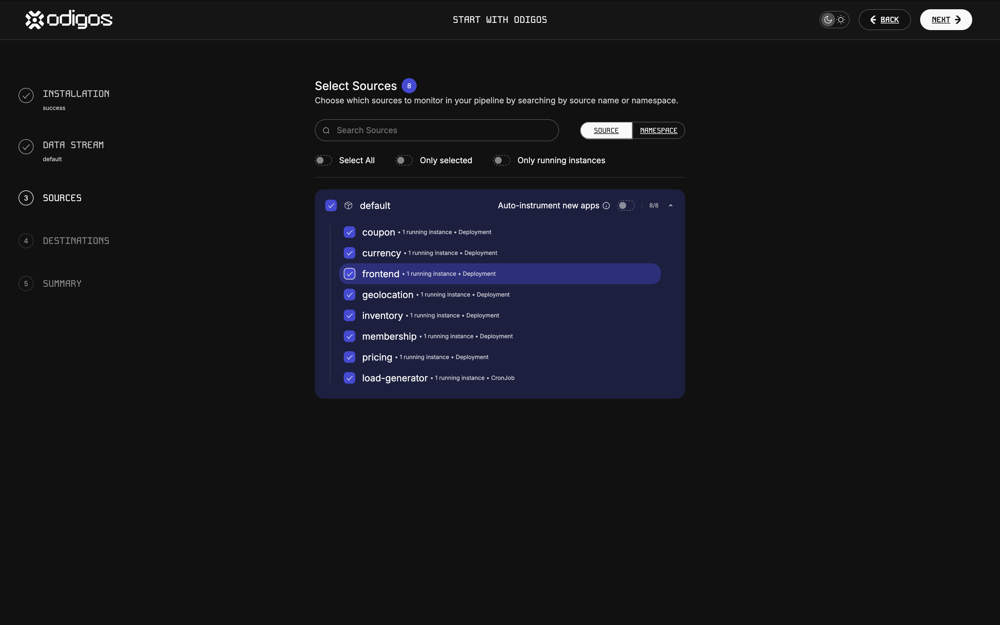

<p align="center">
    <a href="https://github.com/odigos-io/odigos/actions/workflows/release.yml" target="_blank">
        
    </a>
    <a href="https://goreportcard.com/report/github.com/odigos-io/odigos/cli" target="_blank">
        
    </a>
    <a href="https://godoc.org/github.com/odigos-io/odigos/cli" target="_blank">
        
    </a>
</p>

<p align="center">
</br>
<h2>Generate distributed traces for any application in Kubernetes without code changes.</h2>
If you find Odigos helpful, please ⭐ this repository to show your support!
</p>

<h2 align="center">
    <a href="https://www.youtube.com/watch?v=nynyV7FC4VI">Demo Video</a> • <a href="https://docs.odigos.io">Documentation</a> • <a href="https://join.slack.com/t/odigos/shared_invite/zt-1d7egaz29-Rwv2T8kyzc3mWP8qKobz~A">Join Slack Community</a>
</h2>

## What is Odigos?

Odigos is an open-source distributed tracing solution that simplifyes and improves observability for Kubernetes environments. It provides instant tracing capabilities without requiring any code changes to your applications.

## Key Features

- **Code-Free Instrumentation** : Set up distributed tracing in minutes, eliminating manual code modifications.
- **Multi-Language Support** : Works with Java, Python, .NET, Node.js, and Go applications.
- **eBPF-Powered** : Utilizes eBPF technology for high-performance instrumentation of Go applications. eBPF-based instrumentation for Java, Python, and Node.js is available in the enterprise edition.
- **OpenTelemetry Compatible** : Generates traces in OpenTelemetry format for broad tool compatibility.
- **Vendor Agnostic** : Integrates with various monitoring solutions, avoiding vendor lock-in.
- **Automatic Scaling** : Manages and scales OpenTelemetry collectors based on data volume.
- **Opinionated Defaults** : Supplies common defaults and best practices out-of-the-box, requiring no deep knowledge of OpenTelemetry.

## Why Choose Odigos

1. **Simplicity** : Implement distributed tracing with minimal effort and complexity.
2. **Performance** : Separates data recording and processing to minimize runtime impact.
3. **Community-Backed** : With 3,000+ GitHub stars and a growing contributor base.
4. **Expertise** : Created by multiple maintainers of OpenTelemetry, ensuring deep integration and alignment with industry standards.

Odigos empowers platform engineers, DevOps professionals, and SREs to enhance their observability strategies quickly and effectively. It is an ideal solution for modern cloud-native environments, combining simplicity, performance, and industry expertise.

## Features

### ✨ Language Agnostic Auto-instrumentation

Odigos supports any application written in Java, Python, .NET, Node.js, and **Go**.
Historically, compiled languages like Go have been difficult to instrument without code changes. Odigos solves this problem by uniquely leveraging [eBPF](https://ebpf.io).



### 🤝 Keep your existing observability tools

Odigos currently supports all the popular managed and open-source destinations.
By producing data in the [OpenTelemetry](https://opentelemetry.io) format, Odigos can be used with any observability tool that supports OTLP.

For a complete list of supported destinations, see [here](#supported-destinations).


### 🎛️ Collectors Management

Odigos automatically scales OpenTelemetry collectors based on observability data volume.
Manage and configure collectors via a convenient web UI.


## Installation

Installing Odigos takes less than 5 minutes and requires no code changes.
Download our [CLI](https://docs.odigos.io/installation) and run the following command:

```bash
odigos install
```

For more details, see our [quickstart guide](https://docs.odigos.io/intro).

## Supported Destinations

**For step-by-step instructions detailed for every destination, see these [docs](https://docs.odigos.io/backends).**

### Managed Destinations

| Destination             | Traces | Metrics | Logs |
| ----------------------- | :----: | :-----: | :--: |
| AppDynamics             |   ✅   |   ✅    |  ✅  |
| Axiom                   |   ✅   |         |  ✅  |
| AWS S3                  |   ✅   |         |  ✅  |
| Azure Blob Storage      |   ✅   |         |  ✅  |
| Better Stack            |        |   ✅    |  ✅  |
| Causely                 |   ✅   |         |      |
| Chronosphere            |   ✅   |   ✅    |      |
| Coralogix               |   ✅   |   ✅    |  ✅  |
| Datadog                 |   ✅   |   ✅    |  ✅  |
| Dynatrace               |   ✅   |   ✅    |  ✅  |
| Gigapipe                |   ✅   |         |      |
| Google Cloud Monitoring |   ✅   |   ✅    |      |
| Google Cloud Storage    |   ✅   |         |  ✅  |
| Grafana Cloud           |   ✅   |   ✅    |  ✅  |
| Honeycomb               |   ✅   |   ✅    |  ✅  |
| Last9                   |   ✅   |   ✅    |      |
| Lightstep               |   ✅   |         |      |
| Logz.io                 |   ✅   |   ✅    |  ✅  |
| New Relic               |   ✅   |   ✅    |  ✅  |
| OpsVerse                |   ✅   |   ✅    |  ✅  |
| Sentry                  |   ✅   |         |      |
| Splunk                  |   ✅   |         |      |
| Sumo Logic              |   ✅   |   ✅    |  ✅  |

## Self-Hosted (Open Source) Destinations

| Destination   | Traces | Metrics | Logs |
| ------------- | :----: | :-----: | :--: |
| ClickHouse    |   ✅   |   ✅    |  ✅  |
| Elasticsearch |   ✅   |         |  ✅  |
| Jaeger        |   ✅   |         |      |
| Loki          |        |         |  ✅  |
| OTLP          |   ✅   |   ✅    |  ✅  |
| OTLP HTTP     |   ✅   |   ✅    |  ✅  |
| Prometheus    |        |   ✅    |      |
| Quickwit      |   ✅   |         |      |
| qryn          |   ✅   |   ✅    |  ✅  |
| SigNoz        |   ✅   |   ✅    |  ✅  |
| Tempo         |   ✅   |         |      |

Can't find the destination you need? Help us by following our quick [add new destination](https://docs.odigos.io/adding-new-dest) guide and submitting a PR.

## Contributing

Please refer to the [CONTRIBUTING.md](CONTRIBUTING.md) file for information about how to get involved. We welcome issues, questions, and pull requests. Feel free to join our active [Slack Community](https://join.slack.com/t/odigos/shared_invite/zt-1d7egaz29-Rwv2T8kyzc3mWP8qKobz~A).

## All Thanks To Our Contributors

<a href="https://github.com/odigos-io/odigos/graphs/contributors">
  
</a>

## License

This project is licensed under the terms of the Apache 2.0 open-source license. Please refer to [LICENSE](LICENSE) for the full terms.
