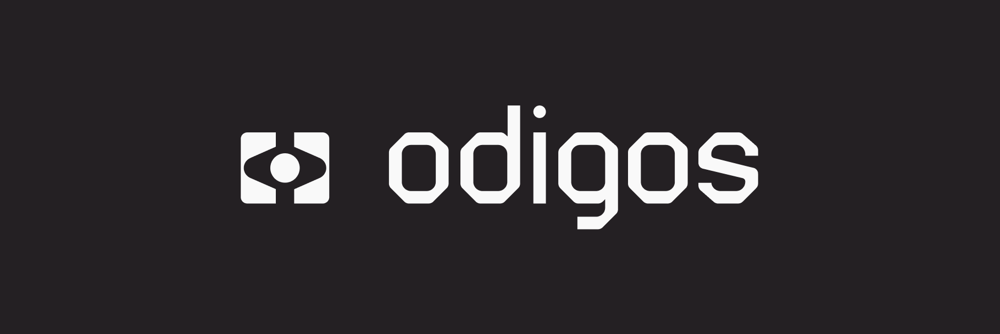

<p align="center">
    <a href="https://github.com/keyval-dev/odigos/actions/workflows/main.yml" target="_blank">
    
    </a>
    <a href="https://goreportcard.com/report/github.com/keyval-dev/odigos/cli" target="_blank">
    
    </a>
    <a href="https://godoc.org/github.com/keyval-dev/odigos/cli" target="_blank">
    
    </a>
</p>
<p align="center">
</br>
Generate distributed traces for any application without code changes
</p>
<h2 align="center">
    <a href="https://www.youtube.com/watch?v=9d36AmVtuGU">Demo Video</a> • <a href="https://docs.odigos.io">Documentation</a> • <a href="https://join.slack.com/t/odigos/shared_invite/zt-1d7egaz29-Rwv2T8kyzc3mWP8qKobz~A">Join Slack Community</a>
</h2>

### ✨ Language Agnostic Auto-instrumentation

Odigos supports any application written in Java, Python, .NET, Node.js and **Go**.  
Historically, compiled languages like Go have been difficult to instrument without code changes. Odigos solves this problem by uniquely leveraging [eBPF](https://ebpf.io).


### 🤝 Keep your existing observability tools
Odigos currently supports all the popular managed and open source destinations.  
By producing data in the [OpenTelemetry](https://opentelemetry.io) format, Odigos can be used with any observability tool that supports OTLP.

For a complete list of supported destinations see [here](#supported-destinations).


### 🎛️ Collectors Management 
Odigos automatically scales OpenTelemetry collectors based on observability data volume.  
A simple UI is also provided to manage and configure collectors.


## Installation

The easiest way to install Odigos is to use our [Helm chart](https://github.com/keyval-dev/odigos-charts):

```console
helm repo add odigos https://keyval-dev.github.io/odigos-charts/

helm install my-odigos odigos/odigos --namespace odigos-system --create-namespace
```

See the [quickstart guide](https://docs.odigos.io/intro) for more details and examples.

## Supported Destinations

**For step by step instructions detailed for every destination see these [docs](https://docs.odigos.io/backends).**

### Managed

|                         | Traces | Metrics | Logs |
|-------------------------| ------ | ------- |------|
| New Relic               | ✅      | ✅      | ✅    |
| Datadog                 | ✅      | ✅      | ✅    |
| Grafana Cloud           | ✅      | ✅      | ✅    |
| Honeycomb               | ✅      | ✅      | ✅    |
| Chronosphere            | ✅      | ✅      |       |
| Logz.io                 | ✅      | ✅      | ✅    |
| qryn.cloud              | ✅      | ✅      | ✅    |
| OpsVerse                | ✅      | ✅      | ✅    |
| Dynatrace               | ✅      | ✅      | ✅    |
| Google Cloud Monitoring | ✅      |         | ✅    |
| Google Cloud Storage    | ✅      |         | ✅    |
| Azure Blob Storage      | ✅      |         | ✅    |
| AWS S3                  | ✅      |         | ✅    |
| Splunk                  | ✅      |         |      |
| Lightstep               | ✅      |         |      |
| Sentry                  | ✅      |         |      |

### Open Source

|               | Traces | Metrics | Logs |
| ------------- | ------ | ------- | ---- |
| Prometheus    |        | ✅      |      |
| Tempo         | ✅     |         |      |
| Loki          |        |         | ✅   |
| Jaeger        | ✅     |         |      |
| SigNoz        | ✅     | ✅      | ✅   |
| qryn          | ✅     | ✅      | ✅   |
| Elasticsearch | ✅     |         | ✅   |

Can't find the destination you need? Help us by following our quick [adding new destination](https://docs.odigos.io/adding-new-dest) guide and submit a PR.

## Contributing

Please refer to the [CONTRIBUTING.md](CONTRIBUTING.md) file for information about how to get involved. We welcome issues, questions, and pull requests. You are welcome to join our active [Slack Community](https://join.slack.com/t/odigos/shared_invite/zt-1d7egaz29-Rwv2T8kyzc3mWP8qKobz~A).

## Project Status

This project is actively maintained by [keyval](https://keyval.dev). We would love to receive your [ideas, feedback & contributions](https://join.slack.com/t/odigos/shared_invite/zt-1d7egaz29-Rwv2T8kyzc3mWP8qKobz~A).

## License

This project is licensed under the terms of the Apache 2.0 open source license. Please refer to [LICENSE](LICENSE) for the full terms.
