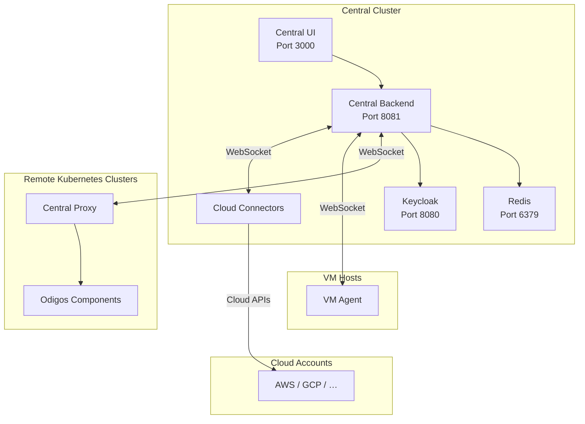

Odigos Central consists of components deployed in a **central (management) cluster**, plus connections to remote platforms: a lightweight proxy in each **remote Kubernetes cluster**, [VM Agent](/central/adding-connections/vmagent) hosts, and optional [Cloud Connectors](/central/adding-connections/cloud-connectors/overview) for cloud accounts.

When [Cloud Connectors are enabled](/central/adding-connections/cloud-connectors/enable), the Central cluster also runs the connector-runtime controller, a dedicated PostgreSQL store for connector state, and per-account provider connector workloads (for example AWS, GCP, and other supported providers) that you create from the UI.

## Components

| Component           | Description                                                                                                     |
| ------------------- | --------------------------------------------------------------------------------------------------------------- |
| **Central UI**      | Web interface for managing connected clusters, VM agents, cloud connectors, sources, destinations, and sampling configurations |
| **Central Backend** | API server that stores configuration in Redis and communicates with remote platforms                            |
| **Central Proxy**   | Lightweight service deployed in each remote cluster that bridges the central backend to local Odigos components |
| **Cloud Connectors** (optional) | Provider runtimes in the Central cluster that discover and instrument cloud workloads for one cloud account boundary each (for example an AWS account or GCP project). See [Cloud Connectors overview](/central/adding-connections/cloud-connectors/overview). |
