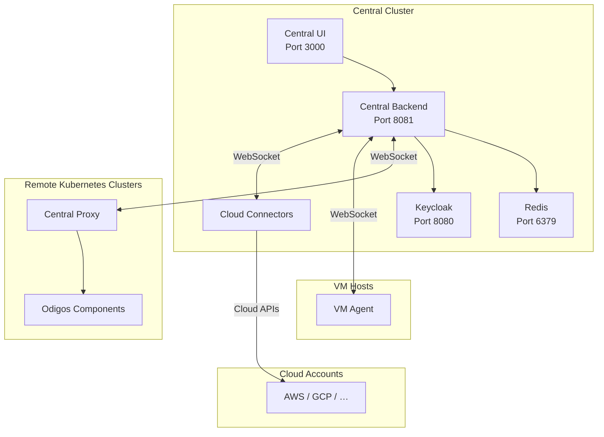

Odigos Central consists of components deployed in a **central (management) cluster**, plus connections to remote platforms: a lightweight proxy in each **remote Kubernetes cluster**, [VM Agent](/central/adding-connections/vmagent) hosts, and optional [Cloud Connectors](/cloud-connectors/overview) for cloud accounts.

When [Cloud Connectors are enabled](/cloud-connectors/enable), the Central cluster also runs the connector-runtime controller, a dedicated PostgreSQL store for connector state, and per-account provider connector workloads (for example AWS, GCP, and other supported providers) that you create from the UI.

## Backend URLs (Helm values)

Several Helm values are named `centralBackendURL`. They are **not interchangeable**.

| Value | Chart | Who uses it | When to set |
| --- | --- | --- | --- |
| `centralProxy.centralBackendURL` | `odigos` (each **remote** cluster) | Central Proxy WebSocket to `/ws/proxy` | **Required** to connect a remote cluster. See [Connecting Remote Clusters](/central/adding-connections/remote-clusters). |
| `centralUI.centralBackendURL` | `odigos-central` | Central UI → backend HTTP | Optional. Default is in-cluster `http://central-backend.<namespace>:8081`. |
| `auth.externalUrl` | `odigos-central` | Browser SSO redirects (Keycloak issuer / proxy URLs) | Set to the **browser-accessible** Central Backend URL (ingress hostname). See [Authentication](/central/authentication). |

`centralProxy.centralBackendURL` is the URL **remote clusters** use to reach Central. `auth.externalUrl` is the URL **browsers** use for SSO. They are often the same public hostname when you terminate TLS on ingress, but they serve different clients.

## Components

| Component           | Description                                                                                                     |
| ------------------- | --------------------------------------------------------------------------------------------------------------- |
| **Central UI**      | Web interface for managing connected clusters, VM agents, cloud connectors, sources, destinations, and sampling configurations |
| **Central Backend** | API server that stores configuration in Redis and communicates with remote platforms                            |
| **Central Proxy**   | Lightweight service deployed in each remote cluster that bridges the central backend to local Odigos components |
| **Cloud Connectors** (optional) | Provider runtimes in the Central cluster that discover and instrument cloud workloads for one cloud account boundary each (for example an AWS account or GCP project). See [Cloud Connectors](/cloud-connectors/overview). |
