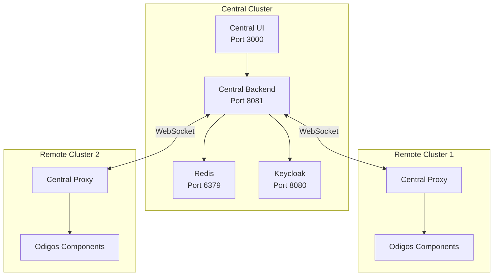

Odigos Central consists of components deployed in a **central (management) cluster** and a lightweight proxy in each **remote cluster**.

## Components

| Component           | Description                                                                                                     |
| ------------------- | --------------------------------------------------------------------------------------------------------------- |
| **Central UI**      | Web interface for managing all connected clusters, sources, destinations, and sampling configurations           |
| **Central Backend** | API server that stores configuration in Redis and communicates with remote clusters via WebSocket               |
| **Central Proxy**   | Lightweight service deployed in each remote cluster that bridges the central backend to local Odigos components |
