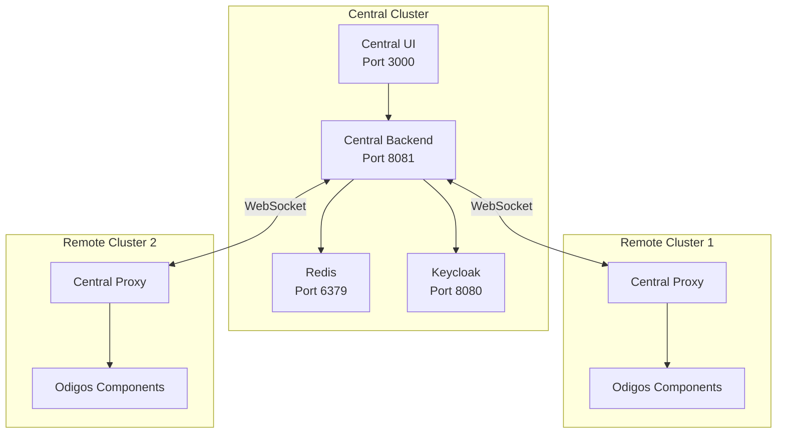

<Note>
  This feature is available in Odigos Enterprise tier only. Please contact the
  Odigos team to inquire about access to the Enterprise version.
</Note>

## Overview

Odigos Central is a centralized management layer for multi-cluster observability. Instead of configuring instrumentation, sampling rules, and destinations separately in each Kubernetes cluster, Odigos Central provides a **single pane of glass** to manage all your clusters from one place.

### Why Use Odigos Central?

- **Unified Management** - Configure instrumentation, sampling rules, and observability pipelines across all clusters from a single UI
- **Reduced Operational Overhead** - No need to SSH or `kubectl` into each cluster separately
- **Centralized Access Control** - Manage user authentication and authorization with support for SSO providers like Okta
- **Consistent Configuration** - Apply the same sampling and instrumentation rules uniformly across environments
- **Audit and Compliance** - Single point of control for observability configuration changes

## Architecture

Odigos Central consists of components deployed in a **central (management) cluster** and a lightweight proxy in each **remote cluster**.



### Components

| Component           | Description                                                                                                     |
| ------------------- | --------------------------------------------------------------------------------------------------------------- |
| **Central UI**      | Web interface for managing all connected clusters, sources, destinations, and sampling configurations           |
| **Central Backend** | API server that stores configuration in Redis and communicates with remote clusters via WebSocket               |                                                    |
| **Central Proxy**   | Lightweight service deployed in each remote cluster that bridges the central backend to local Odigos components |

## Prerequisites

Before installing Odigos Central, ensure you have:

- **Kubernetes** version 1.19.0 or higher
- **Odigos Enterprise license token** (contact Odigos team to obtain)
- **Helm** 3.x (if using Helm installation method)
- **Network connectivity** from remote clusters to the Central Backend endpoint

## Installation

You can install Odigos Central using the CLI or Helm chart.

<Tabs>
  <Tab title="CLI">
    Use the `odigos pro central install` command with `--set` flags:

    ```bash
    odigos pro central install --set onPremToken=<token>
    ```

    This installs:
    - central-backend
    - central-ui
    - redis (for state)
    - keycloak (as identity provider)

    ### CLI Flags

    | Flag | Default | Description |
    |------|---------|-------------|
    | `--set onPremToken` | (required) | Your Odigos Enterprise license token |
    | `--set centralProxy.centralBackendURL` | (optional) | URL of the central backend |
    | `--set auth.externalUrl` | `http://localhost:8081` | Browser-accessible URL of the Central Backend for SSO redirect flows |
    | `--set auth.adminPassword` | (auto-generated) | Admin password for Keycloak. If not provided, a random password is generated |
    | `--set auth.adminUsername` | `admin` | Admin username for Keycloak |
    | `--namespace`, `-n` | `odigos-central` | Target namespace for installation |
    | `--version` | (current) | Specify a specific version to install |

    **Example with all options:**
    ```bash
    odigos pro central install \
      --set onPremToken=<token> \
      --namespace odigos-central \
      --version v1.0.0
    ```

  </Tab>
  <Tab title="Helm">
    Add the Odigos Helm repository and install:

    ```bash
    helm repo add odigos https://odigos-io.github.io/odigos/
    helm repo update
    helm upgrade --install odigos-central odigos/odigos-central \
      --namespace odigos-central \
      --create-namespace \
      --set onPremToken=<token>
    ```

    **Example with additional options:**
    ```bash
    helm upgrade --install odigos-central odigos/odigos-central \
      --namespace odigos-central \
      --create-namespace \
    `

    For production deployments, consider using a `values.yaml` file:

    ```yaml
    onPremToken: "<your-token>"

    auth:
      externalUrl: "https://central.example.com"  # Browser-accessible URL for SSO redirects
      adminUsername: admin
      adminPassword: "<your-password>"
      persistence:
        enabled: true
        size: 2Gi
        storageClassName: "gp3"

    centralBackend:
      autoscaling:
        enabled: true
        minReplicas: 2
        maxReplicas: 10
      resources:
        requests:
          cpu: 200m
          memory: 256Mi
        limits:
          cpu: 1000m
          memory: 1Gi

    centralUI:
      resources:
        requests:
          cpu: 100m
          memory: 128Mi
        limits:
          cpu: 500m
          memory: 512Mi
    ```

    Then install with:
    ```bash
    helm upgrade --install odigos-central odigos/odigos-central \
      --namespace odigos-central \
      --create-namespace \
      -f values.yaml
    ```

  </Tab>
</Tabs>

## Accessing the Central UI

After installation, access the Central UI using port-forward:

```bash
odigos pro central ui
```

This forwards:

- **Central UI** to `http://localhost:3000`
- **Central Backend** to `http://localhost:8081`

### Options

| Flag                | Default          | Description                                 |
| ------------------- | ---------------- | ------------------------------------------- |
| `--address`         | `localhost`      | Address to bind the port-forward to         |
| `--namespace`, `-n` | `odigos-central` | Namespace where Odigos Central is installed |

**Example:** To access from other machines on your network:

```bash
odigos pro central ui --address 0.0.0.0
```

## Connecting Remote Clusters

Once Odigos Central is running, you need to configure your remote clusters to connect to it. This is done by installing Odigos in each remote cluster with the Central Proxy configuration.

<Info>
  Remote clusters require the same Odigos Enterprise license token as the
  central installation.
</Info>

### Using CLI

```bash
odigos install \
  --onprem-token <token> \
  --set centralProxy.centralBackendURL=<your-central-backend-url> \
  --set clusterName=<your-cluster-name>
```

**Example:**

```bash
odigos install \
  --onprem-token <token> \
  --set centralProxy.centralBackendURL=https://central-backend.example.com:8081 \
  --set clusterName=production-east-1
```

### Using Helm

Add the following to your remote cluster's `values.yaml`:

```yaml
clusterName: 'production-east-1'

centralProxy:
  centralBackendURL: 'https://central-backend.example.com:8081'
```

Then install:

```bash
helm upgrade --install odigos odigos/odigos \
  --namespace odigos-system \
  --create-namespace \
  -f values.yaml
```

### TLS Configuration

For production deployments, configure TLS for secure communication between the Central Proxy and Central Backend:

```yaml
centralProxy:
  centralBackendURL: 'https://central-backend.example.com:8081'
  tls:
    # Skip certificate verification (for testing/self-signed certificates only)
    skipVerify: false

    # Secret name containing CA certificate (key: 'ca.crt')
    caSecretName: 'central-ca-cert'

    # Secret name for mTLS client certificate (keys: 'tls.crt', 'tls.key')
    clientCertSecretName: 'central-client-cert'
```

**Create the CA certificate secret:**

```bash
kubectl create secret generic central-ca-cert \
  --from-file=ca.crt=/path/to/ca.crt \
  -n odigos-system
```

**Create the client certificate secret (for mTLS):**

```bash
kubectl create secret generic central-client-cert \
  --from-file=tls.crt=/path/to/client.crt \
  --from-file=tls.key=/path/to/client.key \
  -n odigos-system
```

## Authentication

Odigos Central includes a bundled **Keycloak** instance as its identity provider. Keycloak is **not exposed externally** — the Central Backend acts as a reverse proxy, forwarding all authentication requests (under `/realms/*`) to Keycloak internally. This means you only need to expose the Central Backend and Central UI; no separate ingress or service is needed for Keycloak.

Odigos Central supports two types of external SSO providers:

- **OIDC** — for providers like Azure AD, Auth0, or any OpenID Connect-compatible IdP
- **SAML** — for providers like Okta that use SAML 2.0

Both are configured through the Central UI — Odigos will create the required Keycloak configuration automatically.

### Configuring the External URL

For SSO redirects to work, Keycloak and the Central Backend must know the **browser-accessible URL** of the Central Backend. This is set via the `auth.externalUrl` Helm value.

| Environment | `auth.externalUrl` value |
|---|---|
| Local dev / port-forward | `http://localhost:8081` (default) |
| Ingress with HTTPS | `https://central.example.com` |
| LoadBalancer service | `https://central-lb.prod.internal` |

<Tabs>
  <Tab title="CLI">
    ```bash
    odigos pro central install \
      --set onPremToken=<token> \
      --set auth.externalUrl=https://central.example.com
    ```
  </Tab>
  <Tab title="Helm">
    ```yaml
    auth:
      externalUrl: "https://central.example.com"
    ```

    Or via `--set`:

    ```bash
    helm upgrade --install odigos-central odigos/odigos-central \
      --namespace odigos-central \
      --create-namespace \
      --set onPremToken=<token> \
      --set auth.externalUrl=https://central.example.com
    ```
  </Tab>
</Tabs>

<Info>
  When `auth.externalUrl` is empty (the default), it falls back to `http://localhost:8081`, which works for local development with `odigos pro central ui` port-forwarding.
</Info>

### OIDC Provider Setup (Azure AD, Auth0, etc.)

<Steps>
  <Step title="Create the OIDC Identity Provider in the Central UI">
    Open the Central UI sign-in page, choose your OIDC provider (e.g., Azure AD), and fill in:
    - **Client ID** — from your IdP application
    - **Client Secret** — from your IdP application
    - **Discovery URL** — your IdP's OpenID Connect discovery endpoint
    - **Tenant ID** — (if required by the provider)

    <Info>
      Odigos Central will create/update the required configuration in the bundled Keycloak for you. Avoid configuring the identity provider directly in Keycloak unless you're troubleshooting.
    </Info>
  </Step>

  <Step title="Copy the Callback URL">
    After the provider is created successfully, the Central UI will display a **Callback URL**. Copy this URL and add it to your IdP application settings as the **Redirect URI** (or **Callback URL**).

    <Warning>
      The Login button is disabled until you copy the Callback URL. This ensures you configure your IdP correctly before attempting to sign in.
    </Warning>
  </Step>

  <Step title="Sign in via your OIDC provider">
    Click the **Login** button. You will be redirected to your IdP's sign-in page. After authenticating, you will be redirected back to Odigos Central and the first user account will be created as the admin.
  </Step>
</Steps>

### SAML Provider Setup (Okta, etc.)

<Steps>
  <Step title="Create the SAML Identity Provider in the Central UI">
    Open the Central UI sign-in page, choose SAML, and fill in the IdP details from your SAML provider:
    - **IdP Entity ID / Issuer**
    - **Single Sign-On Service URL**
    - **X.509 Signing Certificate**

    <Info>
      Odigos Central will create/update the required configuration in the bundled Keycloak for you. Avoid configuring the identity provider directly in Keycloak unless you're troubleshooting.
    </Info>
  </Step>

  <Step title="Copy the Callback URL (ACS URL)">
    After the provider is created, the Central UI will display the **Callback URL (ACS URL)**. Copy this URL and configure it in your SAML provider:
    - **Single sign-on URL** (ACS URL)
    - **Audience URI (SP Entity ID)** — use the same URL or the realm URL depending on your provider

    <Warning>
      The Login button is disabled until you copy the Callback URL. Make sure to add it to your SAML application before proceeding.
    </Warning>
  </Step>

  <Step title="Sign in via your SAML provider">
    Click the **Login with SAML** button. You will be redirected to your IdP's sign-in page. After authenticating, you will be redirected back to Odigos Central and the first user account will be created as the admin.
  </Step>
</Steps>

### Production Ingress Configuration

When deploying behind an ingress, route traffic to the Central Backend and Central UI services only. Keycloak does **not** need its own ingress — the Central Backend handles all `/realms/*` requests internally.

Example routing:

| Path | Service | Port |
|---|---|---|
| `/` | `central-ui` | 3000 |
| `/api/*`, `/graphql`, `/realms/*` | `central-backend` | 8081 |

<Info>
  If you're looking to enable OIDC for the **non-central** Odigos UI (not Odigos
  Central), see the dedicated OIDC documentation: [`OIDC (OpenID
  Connect)`](/features/oidc).
</Info>

## Upgrade

To upgrade Odigos Central to a newer version:

### Using CLI

```bash
odigos pro central upgrade --version <version>
```

**Options:**

| Flag                         | Default          | Description                            |
| ---------------------------- | ---------------- | -------------------------------------- |
| `--version`                  | (required)       | Version to upgrade to (e.g., `v1.2.0`) |
| `--namespace`, `-n`          | `odigos-central` | Target namespace                       |
| `--yes`                      | `false`          | Skip confirmation prompt               |
| `--image-pull-secrets`       | (existing)       | Update image pull secrets              |
| `--central-max-message-size` | (existing)       | Update max gRPC message size           |

**Example:**

```bash
odigos pro central upgrade --version v1.2.0 --yes
```

### Using Helm

```bash
helm repo update
helm upgrade odigos-central odigos/odigos-central \
  --namespace odigos-central \
  --reuse-values \
  --version <chart-version>
```

<Note>
  When upgrading, the Keycloak admin password is preserved from the existing
  secret to prevent credential mismatch.
</Note>

## Uninstall

To completely remove Odigos Central:

### Using CLI

```bash
odigos pro central uninstall
```

**Options:**

| Flag                | Default          | Description              |
| ------------------- | ---------------- | ------------------------ |
| `--namespace`, `-n` | `odigos-central` | Target namespace         |
| `--yes`             | `false`          | Skip confirmation prompt |

**Example:**

```bash
odigos pro central uninstall --namespace odigos-central --yes
```

### Using Helm

```bash
helm uninstall odigos-central --namespace odigos-central
kubectl delete namespace odigos-central
```

<Warning>
  Uninstalling Odigos Central will disconnect all remote clusters. Make sure to
  plan for this accordingly.
</Warning>

### Network Requirements

Ensure the following network connectivity:

| Source                 | Destination     | Port | Protocol        |
| ---------------------- | --------------- | ---- | --------------- |
| Users                  | Central UI      | 3000 | HTTPS           |
| Central UI             | Central Backend | 8081 | HTTP/HTTPS      |
| Central Backend        | Redis           | 6379 | TCP             |
| Central Backend        | Keycloak        | 8080 | HTTP            |
| Remote Cluster Proxies | Central Backend | 8081 | WebSocket (WSS) |

<Warning>
  Odigos Central is an Enterprise feature and requires a valid license token.
  Make sure your `--onprem-token` is valid and has the necessary permissions.
</Warning>
