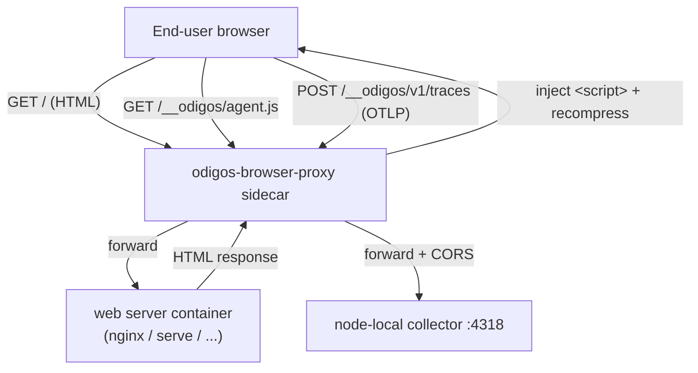

Odigos can instrument **front-end web applications** with the [OpenTelemetry Web SDK](https://opentelemetry.io/docs/languages/js/getting-started/browser/),
capturing browser-side telemetry such as page loads, `fetch`/`XHR` requests, and user interactions.

<Note>
  Browser instrumentation is fundamentally different from Odigos' server-side language agents. The
  telemetry SDK runs in the **end user's browser**, not in a process inside the pod, so it cannot be
  auto-detected from `/proc` and must be enabled explicitly (see [Enabling](#enabling) below).
</Note>

## How it works

Because the OpenTelemetry Web SDK runs in the browser, Odigos does not mount agent files into the
application container or set runtime environment variables. Instead it injects a small sidecar,
`odigos-browser-proxy`, in front of the web server container:



The sidecar:

1. **Injects** a `<script>` tag that loads the OpenTelemetry Web SDK bundle into `text/html` responses
   (gzip-aware), configured at runtime via an injected `window.__ODIGOS__` global.
2. **Serves** the SDK bundle at the same-origin path `/__odigos/agent.js`.
3. **Receives** the browser's OTLP/HTTP telemetry at the same-origin path `/__odigos/v1/traces` and
   **forwards** it to the node-local Odigos collector. Because telemetry is sent same-origin, no CORS
   configuration or public collector endpoint is required.

An init container installs an `iptables` rule (Istio-style) that transparently redirects the
application's inbound traffic to the sidecar, so the Kubernetes `Service` does not need to change.

## Enabling

Front-end workloads cannot be reliably auto-detected, so browser instrumentation is **opt-in** per
container. Create (or edit) a `Source` for the workload and set a container override that selects the
`browser-community` distribution on the serving container:

```yaml
apiVersion: odigos.io/v1alpha1
kind: Source
metadata:
  name: my-frontend-source
  namespace: my-namespace
spec:
  workload:
    name: my-frontend
    namespace: my-namespace
    kind: Deployment
  containerOverrides:
    - containerName: my-frontend          # the container serving the HTML
      otelDistroName: browser-community
```

<Tip>
  If your front-end is served by a process Odigos would otherwise auto-instrument as server-side code
  (for example a Node.js static-file server), the `browser-community` override takes precedence and the
  server-side agent is not applied to that container.
</Tip>

When the workload's pods are (re)created, Odigos injects the `odigos-browser-proxy` sidecar and the
traffic-redirect init container. Open the application in a browser and confirm that browser traces
arrive at your configured destination.

## Requirements & notes

- The serving container must expose a TCP `containerPort`; the sidecar fronts that port.
- The redirect init container requires the `NET_ADMIN` capability. Namespaces enforcing a restrictive
  Pod Security Standard may need an exception for the instrumented workload.
- Only `text/html` responses are rewritten; all other responses (assets, APIs) pass through unchanged.
