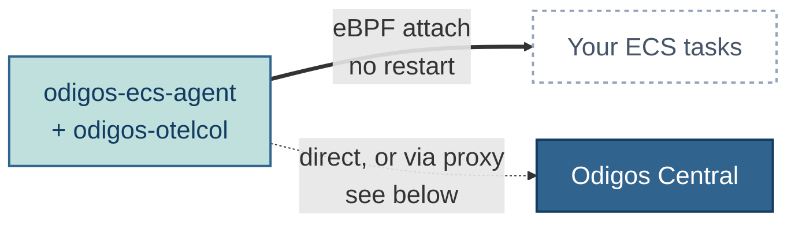
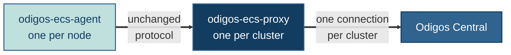

import EnterpriseVMAgent from '/snippets/enterprise/vmagent/enterprise-vm-agent.mdx'

<EnterpriseVMAgent />

The **Odigos ECS Agent** is the same agent as the [VM Agent](/vmagent/overview),
packaged as a container image and deployed as an ECS **daemon service** — one
agent task on every EC2 container instance in the cluster.

Each agent discovers the ECS tasks running on its instance through the
instance's Docker daemon, instruments them **in place** with eBPF, and runs the
`odigos-otelcol` collector as a supervised child process to export the
telemetry.

<Note>
  Instrumentation is **direct attach only**: the agent never restarts,
  recreates, or modifies your task definitions. Deploying Odigos does not
  redeploy your services.
</Note>

## How it works

One agent per container instance, repeated across every instance in the
cluster. Each agent connects upstream either **directly to Central** (single
node) or **through the proxy** (multi node) — see
[Choose a deployment mode](#choose-a-deployment-mode) below.

- **Discovery** — the agent reads the instance's Docker socket to map processes
  to ECS tasks, services, and task ARNs. Only ECS-managed containers are
  instrumented; host processes and `systemd` services on the container instance
  are ignored (unlike the [VM Agent](/vmagent/setup/installation) and
  [Docker deployment](/vmagent/setup/docker)).
- **Instrumentation** — Java, Go, and C++ attach through their dynamic eBPF
  SDKs. Every other language is covered by
  [OBI](/oss/instrumentations/obi), which also attaches with no restart.
  Restart-based instrumentation (Python/Node.js/.NET environment injection) is
  intentionally not used on ECS, since ECS owns the container lifecycle.
- **Export** — the collector runs inside the agent container with host
  networking, so instrumented tasks reach it on the instance's network
  namespace. Destinations, actions, and rules are managed exactly as on the VM
  Agent.

## Choose a deployment mode

Both modes run the same agent daemon and instrument workloads identically. The
difference is **how the cluster appears in Odigos Central** and whether you
deploy one extra component.

| | **Agent only** | **Agent + Proxy** |
|---|---|---|
| What runs | the agent daemon service | the agent daemon service **+** one `odigos-ecs-proxy` task per cluster |
| Upstream connections | every agent dials Central directly | only the proxy dials Central; agents dial the proxy |
| How it appears in Central | one platform **per node** | **one** platform, named after the cluster |
| Cluster-wide workload list | no — per node | yes, aggregated across nodes |
| Config replay for new nodes | each node is configured on its own | yes — the proxy journals config changes and replays them to nodes that join later |
| Coverage check (nodes missing an agent) | — | yes, opt-in |
| Extra AWS resources | none | a stable address for the proxy: none if pinned to an instance, or one internal NLB |
| Guide | [Single Node](/vmagent/ecs/installation-agent-only) | [Multi Node](/vmagent/ecs/installation-with-proxy) |

Select your cluster shape for the installation flow:

<Tabs>
  <Tab title="Single node (Agent only)">
    **One container instance — the agent alone is all you need.**

    The agent daemon runs on the instance and connects straight to Odigos
    Central, which shows the cluster as a single platform named after it. No
    proxy, no load balancer, no extra AWS resources.

    <Steps>
      <Step title="Store the license token">AWS Secrets Manager (or a plain env var for a test cluster).</Step>
      <Step title="Create two IAM roles">Task execution role, plus a task role for `odictl` over ECS Exec.</Step>
      <Step title="Register the agent task definition">Privileged, `pidMode: host`, host networking, with your Central endpoint in `ODIGOS_DEFAULT_CONFIG`.</Step>
      <Step title="Create the DAEMON service">One agent task per container instance, now and for instances that join later.</Step>
      <Step title="Verify">Kernel 5.10+, agent connected, platform visible in Central.</Step>
    </Steps>

    <Card title="Install: Single Node" icon="server" href="/vmagent/ecs/installation-agent-only">
      Follow the full Agent-only flow.
    </Card>

    <Note>
      This flow also works unchanged on a **multi-node** cluster — you simply get
      one platform per node instead of one per cluster. Choose it whenever you
      don't need cluster-wide aggregation.
    </Note>
  </Tab>

  <Tab title="Multi node (Agent + Proxy)">
    **Several container instances that should behave as one cluster.**

    The agent daemon still runs on every instance, but the agents dial a single
    `odigos-ecs-proxy` task instead of Central. The proxy is the cluster's only
    upstream connection, so Central shows **one** platform with aggregated
    workloads, cluster-wide configuration, config replay for nodes that join
    later, and an optional coverage check.

    <Steps>
      <Step title="Store the license token and create the IAM roles">Same two roles as the single-node flow, plus optional coverage permissions for the proxy.</Step>
      <Step title="Give the proxy a stable address">Pin it to one instance (no extra AWS resources) or front it with an internal NLB (survives instance replacement).</Step>
      <Step title="Deploy the proxy first">One task per cluster, listening on TCP 4321.</Step>
      <Step title="Register the agent task definition">Endpoint set to the proxy, plus `ODIGOS_ECS_BEHIND_PROXY=true`.</Step>
      <Step title="Create the DAEMON service">Agents connect to the already-live proxy on first boot.</Step>
      <Step title="Verify">Agents connected, proxy `/healthz` lists every node, one platform in Central.</Step>
    </Steps>

    <Card title="Install: Multi Node" icon="sitemap" href="/vmagent/ecs/installation-with-proxy">
      Follow the full Agent + Proxy flow.
    </Card>
  </Tab>
</Tabs>

<Tip>
  **Not sure? Start single node.** The flow is identical on a 1-node or a 50-node
  cluster, and moving to Agent + Proxy later is just re-pointing the agents'
  endpoint at the proxy and rolling the daemon service — no reinstall. See
  [Switch from single node to multi node](/vmagent/ecs/maintenance#switch-from-single-node-to-multi-node).
</Tip>

## What the proxy adds

`odigos-ecs-proxy` is the ECS counterpart of the Kubernetes `central-proxy`:
one task per cluster that represents the whole cluster to Odigos Central as a
single compute platform.

- **Request routing** — configuration queries go to any one healthy agent (the
  config is identical on all of them); live state such as workload reports fans
  out to every agent and is merged; configuration changes are broadcast to all
  agents.
- **Config journal** — configuration changes are recorded, so a node that joins
  the cluster later (or a task that migrates to a fresh instance) converges to
  the cluster configuration automatically.
- **Membership and coverage** — `GET /healthz` lists the connected agents,
  departed nodes, and — when
  [coverage checking](/vmagent/ecs/configuration#proxy-environment-variables) is
  enabled — ACTIVE container instances that have no agent connected.

The proxy is unprivileged: no host PID, no Docker socket, no host mounts.

## Not supported: Fargate

The ECS Agent requires the **EC2 launch type**. It needs host PID access, the
instance's Docker socket, and the ability to load eBPF programs — none of which
exist on Fargate, where AWS controls the host. There is no Fargate deployment
mode.

## Next steps

<CardGroup cols={2}>
  <Card title="System Requirements" icon="list-check" href="/vmagent/ecs/requirements">
    Launch type, kernel and AMI requirements, IAM, and images.
  </Card>
  <Card title="Install: Single Node" icon="server" href="/vmagent/ecs/installation-agent-only">
    Agent only — daemon service, direct to Central.
  </Card>
  <Card title="Install: Multi Node" icon="sitemap" href="/vmagent/ecs/installation-with-proxy">
    Agent + Proxy — one platform per cluster, with aggregation and config replay.
  </Card>
  <Card title="Configuration Reference" icon="sliders" href="/vmagent/ecs/configuration">
    Every environment variable, platform naming, and required permissions.
  </Card>
</CardGroup>
