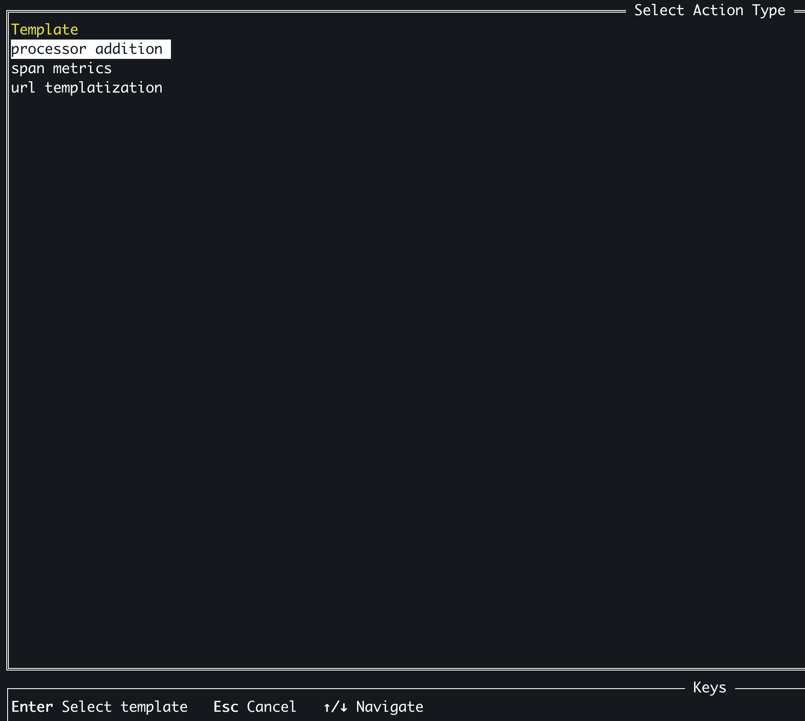
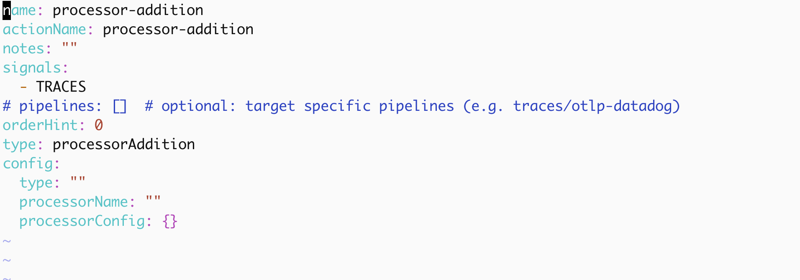
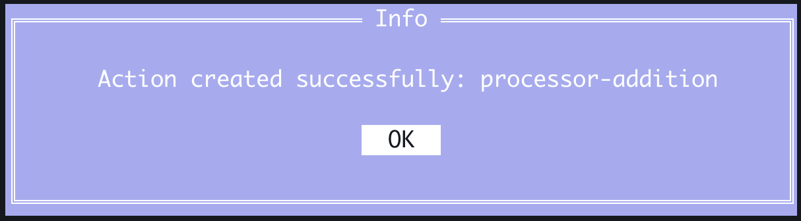
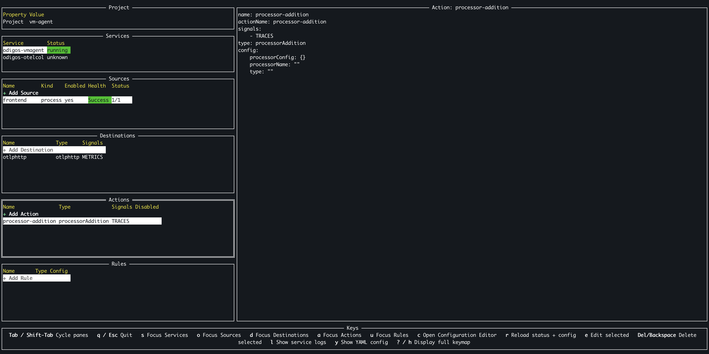

[Processor addition](./overview#processor-addition) lets you add an OpenTelemetry Collector processor to transform, filter, or enrich signals (e.g., add or delete attributes, batch, sample, mask PII). Processors defined in the [Odigos collector builder config](https://github.com/odigos-io/odigos/blob/main/collector/builder-config.yaml#L61) are supported.

There are two ways to add a processor addition action: using `odictl` or using YAML files.

<Tabs>
  <Tab title="odictl">
    <Steps>
      <Step title="Launch odictl">
        ```shell
        odictl
        ```
      </Step>
      <Step title="Select the actions menu">
        Use `Tab` to focus on the Actions pane or press `a`, then press `Enter` or click `+ Add Action` with your mouse.

        

      </Step>
      <Step title="Select Processor addition">
        Use the arrow keys to move through the list of action types. When **Processor addition** is highlighted, press `Enter`.

        

      </Step>
      <Step title="Configure the processor addition">

        1. Press `i` to enter INSERT mode.
        2. Set the processor type and options. Only processors listed in the [Odigos collector builder config](https://github.com/odigos-io/odigos/blob/main/collector/builder-config.yaml#L61) are supported. Set the processor name (e.g., `attributes`, `batch`) and fill in any processor-specific configuration.
        3. When finished, press `Esc`, then type `:wq` to save and exit.

        

        <Note>To cancel creating the action, press `Esc` if you are in INSERT mode, then type `:q!` to exit without saving.</Note>
      </Step>
      <Step title="Complete adding the action">
        Select `OK`. The action appears in the **Actions** section in `odictl`.

        

      </Step>
      <Step title="Verify the action has been created">

        

      </Step>
    </Steps>
  </Tab>
  <Tab title="YAML">
    <Steps>
      <Step title="Navigate to the actions configuration folder">
        ```shell
        cd /etc/odigos-vmagent/actions.d
        ```
      </Step>
      <Step title="Create an action YAML file">
        Create a YAML file for your action using the editor of your choice. The example below uses [vi](https://en.wikipedia.org/wiki/Vi).

        ```shell
        sudo vi processor-addition.yaml
        ```
      </Step>
      <Step title="Add the processor addition configuration">
        Add a processor addition action with the desired processor type and config. Processors listed in the [Odigos collector builder config](https://github.com/odigos-io/odigos/blob/main/collector/builder-config.yaml#L61) are supported. Set `config.type` to one of those processor names (e.g., `attributes`, `batch`), and use `config.processorConfig` for processor-specific options. See the [OpenTelemetry Collector Contrib documentation](https://github.com/open-telemetry/opentelemetry-collector-contrib/tree/main/processor) for each processor's configuration.

        For example:

        ```yaml
        name: processor-addition
        actionName: processor-addition
        notes: ""
        signals:
          - TRACES
        # pipelines: []  # optional: target specific pipelines (e.g. traces/otlp-datadog)
        orderHint: 0
        type: processorAddition
        config:
          type: ""
          processorName: ""
          processorConfig: {}
        ```

        <Note>Replace `config.type` with the processor type (e.g., `attributes`, `batch`), set `config.processorName` if desired, and fill `config.processorConfig` with the processor's configuration.</Note>
      </Step>
      <Step title="Save the file">
        ```shell
        :wq!
        ```
      </Step>
      <Step title="Verify the action has been created">

        ```shell
        sudo journalctl -u odigos-vmagent | grep 'Action created'
        ```

        ```
        Mar 11 21:59:43 ip-10-0-1-51 odigos-vmagent[611]: time=2026-03-11T21:59:43.580Z level=INFO source=/go/src/github.com/keyval/odigos-vmagent/pkg/components/controller/tower/mutations/create_action_handler.go:41 msg="Action created" name=processor-addition
        ```

      </Step>
    </Steps>
  </Tab>
</Tabs>
