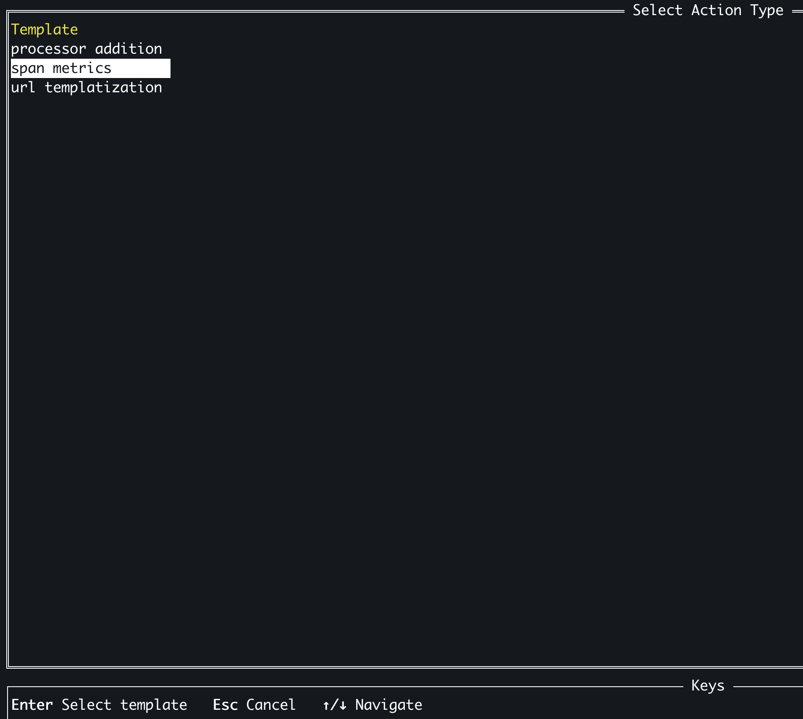
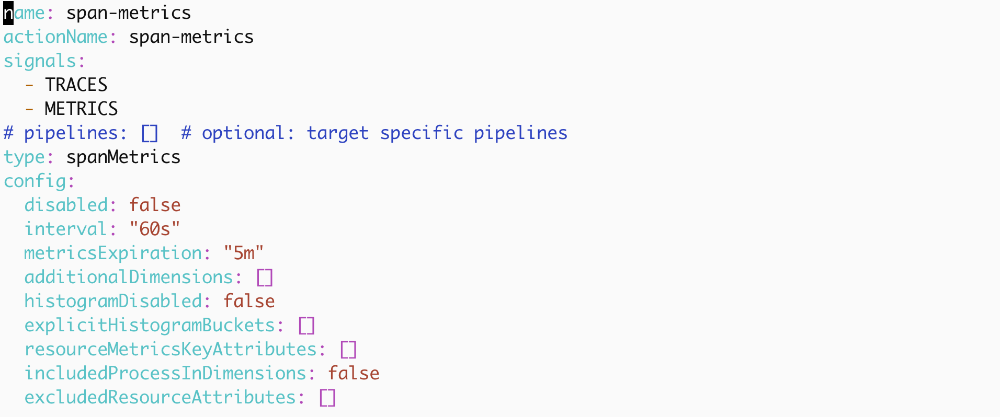
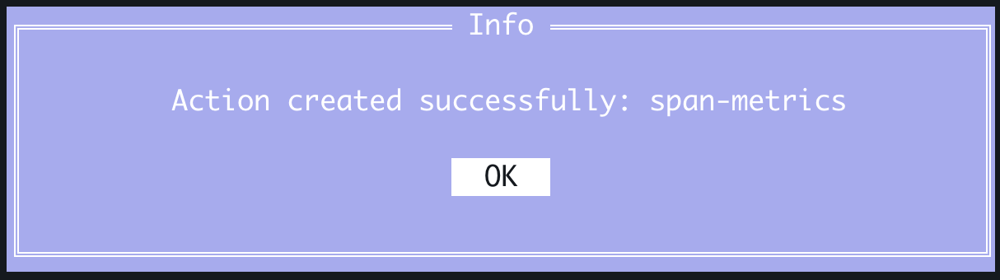
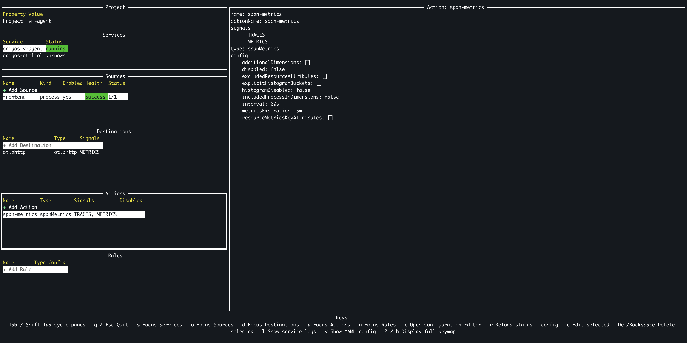

[Span metrics](./overview#span-metrics) is a processor that turns tracing spans into aggregated metrics (e.g., request counts, latency histograms), reducing export volume and making it easier to build dashboards and alerts.

There are two ways to add a span metrics action: using `odictl` or using YAML files.

<Tabs>
  <Tab title="odictl">
    <Steps>
      <Step title="Launch odictl">
        ```shell
        odictl
        ```
      </Step>
      <Step title="Select the actions menu">
        Use `Tab` to focus on the Actions pane or press `a`, then press `Enter` or click `+ Add Action` with your mouse.
      
        

      </Step>
      <Step title="Select Span metrics">
        Use the arrow keys to move through the list of action types. When **Span metrics** is highlighted, press `Enter`.
      
        

      </Step>
      <Step title="Configure span metrics">
        1. Press `i` to enter INSERT mode.
        2. Adjust options such as `interval`, `metricsExpiration`, and histogram settings as needed.
        3. When finished, press `Esc`, then type `:wq` to save and exit.

        

        <Note>To cancel creating the action, press `Esc` if you are in INSERT mode, then type `:q!` to exit without saving.</Note>
      </Step>
      <Step title="Complete adding the action">
        Select `OK`. The action appears in the **Actions** section in `odictl`.

        

      </Step>
      <Step title="Verify the action has been created">

        

      </Step>
    </Steps>
  </Tab>
  <Tab title="YAML">
    <Steps>
      <Step title="Navigate to the actions configuration folder">
        ```shell
        cd /etc/odigos-vmagent/actions.d
        ```
      </Step>
      <Step title="Create an action YAML file">
        Create a YAML file for your action using the editor of your choice. The example below uses [vi](https://en.wikipedia.org/wiki/Vi).

        ```shell
        sudo vi span-metrics.yaml
        ```
      </Step>
      <Step title="Add the span metrics configuration">
        Add a span metrics action. You can adjust `interval`, `metricsExpiration`, `additionalDimensions`, and other resource attributes to match your needs.

        For example:

        ```yaml
        name: span-metrics
        actionName: span-metrics
        signals:
          - TRACES
          - METRICS
        # pipelines: []  # optional: target specific pipelines
        type: spanMetrics
        config:
          disabled: false
          interval: "60s"
          metricsExpiration: "5m"
          additionalDimensions: []
          histogramDisabled: false
          explicitHistogramBuckets: []
          resourceMetricsKeyAttributes: []
          includedProcessInDimensions: false
          excludedResourceAttributes: []
        ```
      </Step>
      <Step title="Save the file">
        ```shell
        :wq!
        ```
      </Step>
      <Step title="Verify the action has been created">

        ```shell
        sudo journalctl -u odigos-vmagent | grep 'Action created'
        ```

        ```
        Mar 11 21:59:43 ip-10-0-1-51 odigos-vmagent[611]: time=2026-03-11T21:59:43.580Z level=INFO source=/go/src/github.com/keyval/odigos-vmagent/pkg/components/controller/tower/mutations/create_action_handler.go:41 msg="Action created" name=span-metrics
        ```

      </Step>
    </Steps>
  </Tab>
</Tabs>
