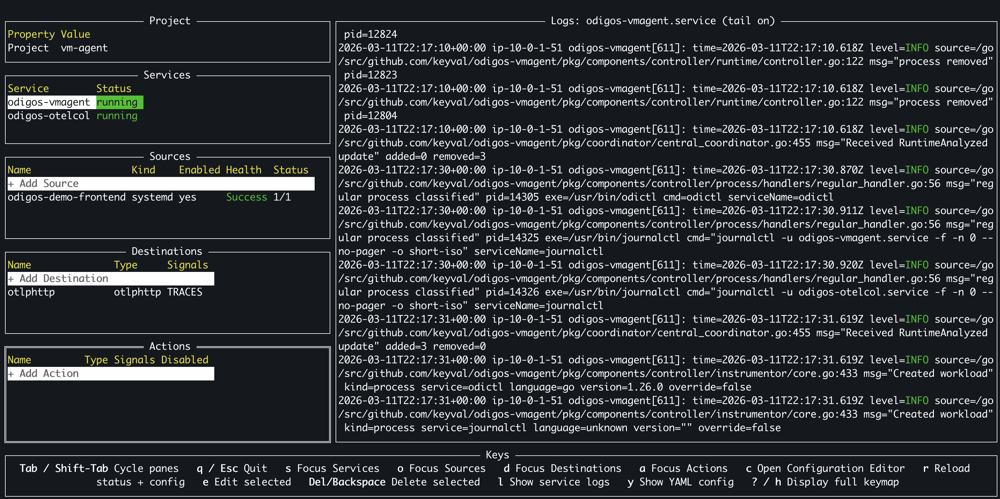
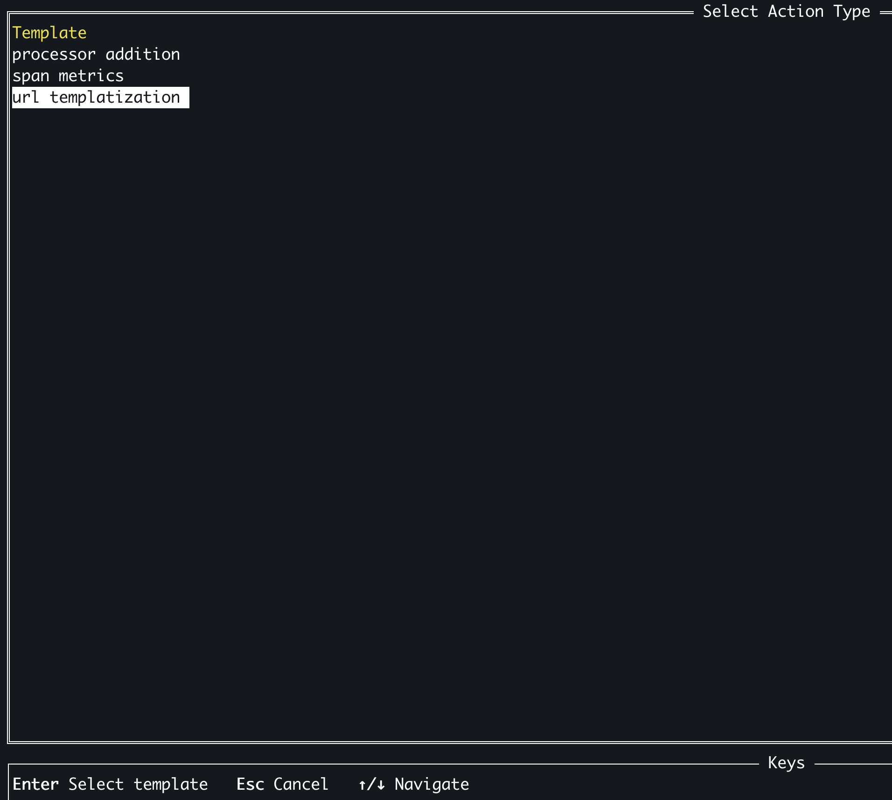
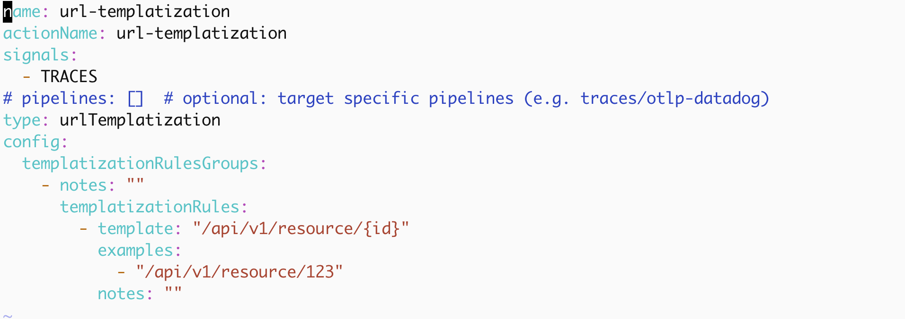
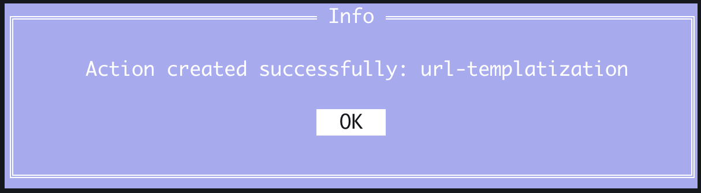
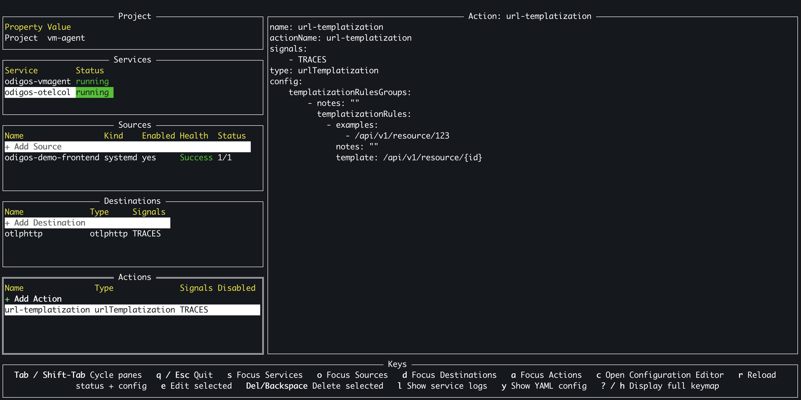

[URL templatization](./overview#url-templatization) replaces variable parts of URLs with parameter placeholders before the URL is recorded in trace data (e.g., `/users/123` → `/users/{id}`), keeping cardinality under control and making it easier to group traffic by endpoint pattern.

There are two ways to add a URL templatization action: using `odictl` or using YAML files.

<Tabs>
  <Tab title="odictl">
    <Steps>
      <Step title="Launch odictl">
        ```shell
        odictl
        ```
      </Step>
      <Step title="Select the actions menu">
        Use `Tab` to focus on the Actions pane or press `a`, then press `Enter` or click `+ Add Action` with your mouse.

        

      </Step>
      <Step title="Select URL Templatization">
        Use the arrow keys to move through the list of action types. When **URL templatization** is highlighted, press `Enter`.

        

      </Step>
      <Step title="Configure URL templatization">
        1. Press `i` to enter INSERT mode.
        2. Add one or more templatization rules with a `template` (e.g., `/api/v1/resource/{id}`) and optional `examples`.
        3. When finished, press `Esc`, then type `:wq` to save and exit.

        

        <Note>To cancel creating the action, press `Esc` if you are in INSERT mode, then type `:q!` to exit without saving.</Note>
      </Step>
      <Step title="Complete adding the action">
        Select `OK`. The action appears in the **Actions** section in `odictl`.

        

      </Step>
      <Step title="Verify the action has been created">

        

      </Step>
    </Steps>
  </Tab>
  <Tab title="YAML">
    <Steps>
      <Step title="Navigate to the actions configuration folder">
        ```shell
        cd /etc/odigos-vmagent/actions.d
        ```
      </Step>
      <Step title="Create an action YAML file">
        Create a YAML file for your action using the editor of your choice. The example below uses [vi](https://en.wikipedia.org/wiki/Vi).

        ```shell
        sudo vi url-templatization.yaml
        ```
      </Step>
      <Step title="Add the URL templatization configuration">
        Add a URL templatization action with one or more rule groups. Each rule has a `template` (e.g., `/api/v1/resource/{id}`), optional `examples` of matching URLs, and optional `notes`.

        For example:

        ```yaml
        name: url-templatization
        actionName: url-templatization
        signals:
          - TRACES
        # pipelines: []  # optional: target specific pipelines (e.g. traces/otlp-datadog)
        type: urlTemplatization
        config:
          templatizationRulesGroups:
            - notes: ""
              templatizationRules:
                - template: "/api/v1/resource/{id}"
                  examples:
                    - "/api/v1/resource/123"
                  notes: ""
        ```
      </Step>
      <Step title="Save the file">
        ```shell
        :wq!
        ```
      </Step>
      <Step title="Verify the action has been created">

        ```shell
        sudo journalctl -u odigos-vmagent | grep 'Action created'
        ```

        ```
        Mar 11 21:59:43 ip-10-0-1-51 odigos-vmagent[611]: time=2026-03-11T21:59:43.580Z level=INFO source=/go/src/github.com/keyval/odigos-vmagent/pkg/components/controller/tower/mutations/create_action_handler.go:41 msg="Action created" name=url-templatization
        ```

      </Step>
    </Steps>
  </Tab>
</Tabs>
