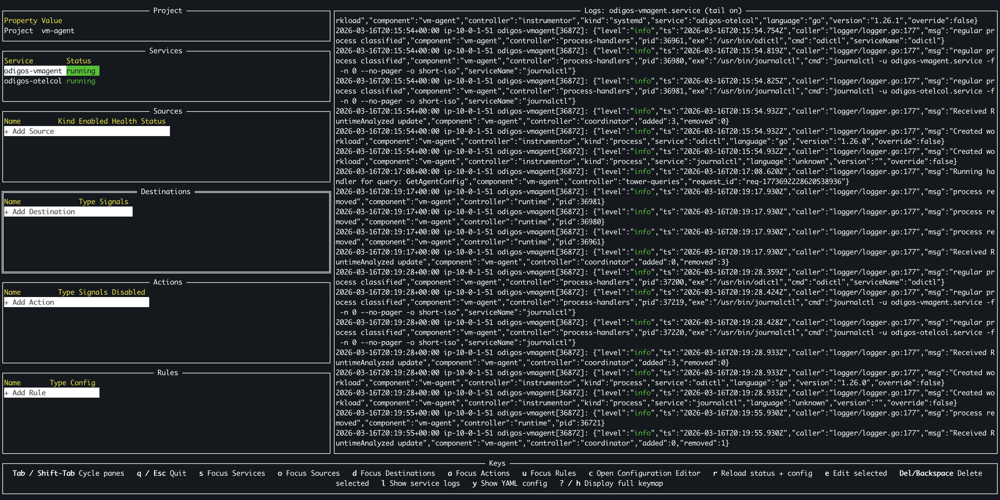
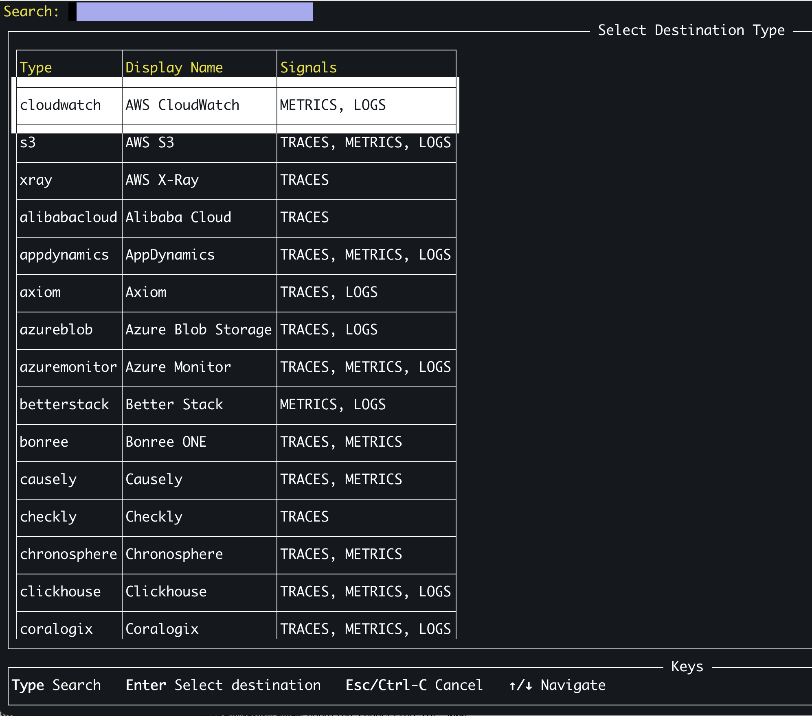
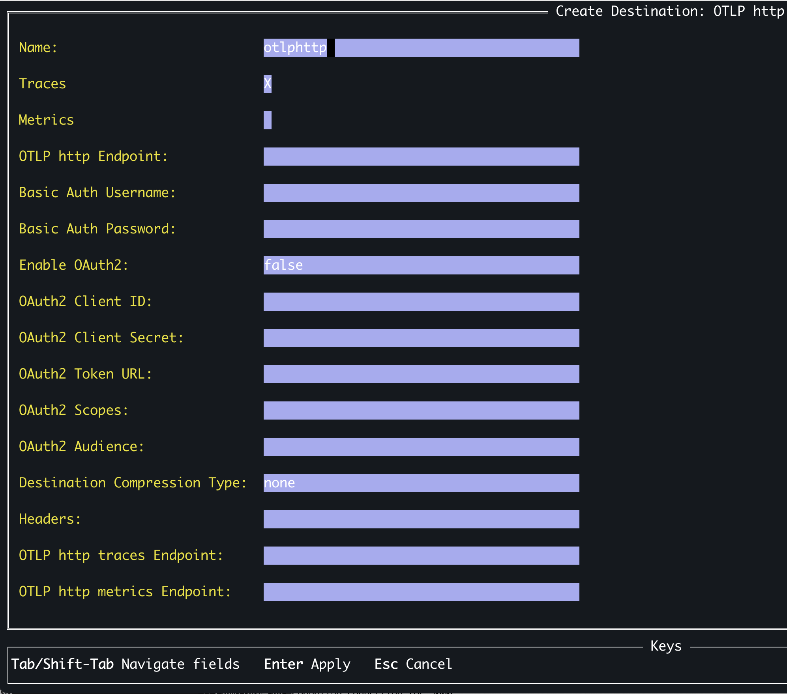
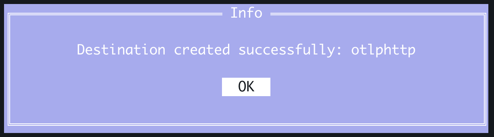
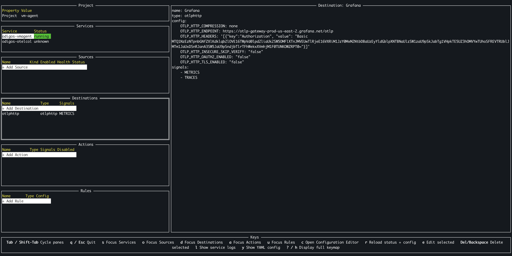

There are two ways to add [destinations](../../../overview#key-concepts) to the Odigos VM Agent: use `odictl` or use YAML files.

<Tabs>
  <Tab title="odictl">
  <Steps>
    <Step title="Launch odictl">
      ```shell
      odictl
      ```
    </Step>
    <Step title="Select the destination menu">
      Use `Tab` to focus on the Destinations pane or press `d`, then press `Enter` or click `+ Add Destination` with your mouse.

      
    </Step>
    <Step title="Select a destination">
      Type the name of the destination in the search bar at the top, and/or press `Tab` and scroll through the list
      of destinations. Once your destination is highlighted, press `Enter`.

      
    </Step>
    <Step title="Configure destination">
      Set each field according to your destination type. See [Destinations](../../../../enterprise/backends-overview) 
      for field details and requirements.

      <Frame caption="Example of an [OTLP http](../../../../enterprise/backends-overview) destination">
        
      </Frame>

      Fill in the required fields. Press `Tab` to navigate to `Apply`, then press `Enter` to save your destination.

    </Step>
    <Step title="Finish adding the destination">

      Select `OK`.

      

      Your destination appears in the `Destinations` section in `odictl`.

      

    </Step>
  </Steps>
  </Tab>
  <Tab title="YAML">
    <Steps>
      <Step title="Navigate to the /etc/odigos-vmagent/destinations.d folder">
    
        ```shell
        cd /etc/odigos-vmagent/destinations.d
        ```

      </Step>
      <Step title="Create destination YAML file">

        Create a YAML file for your destination's configuration using the editor of your choice. The example below uses [vi](https://en.wikipedia.org/wiki/Vi).

        ```shell
        sudo vi example.yaml
        ```

      </Step>
      <Step title="Add the destination configuration">

        Set each field according to your destination type. See [Destinations](../../../../enterprise/backends-overview) for field details and requirements.


        For example:
        ```yaml
        - name: otlphttp
          type: otlphttp
          config:
            OTLP_HTTP_COMPRESSION: none
            OTLP_HTTP_ENDPOINT: https://otlp-example.com
            OTLP_HTTP_INSECURE_SKIP_VERIFY: "false"
            OTLP_HTTP_OAUTH2_ENABLED: "false"
            OTLP_HTTP_TLS_ENABLED: "false"
          signals:
            - TRACES
        ```
        <Info>The above is an example of an [OTLP http](../../../../enterprise/backends-overview) destination.</Info>

        <Note>You can define multiple destinations in a single YAML file, and you can organize destinations across multiple YAML files.</Note>

      </Step>
      <Step title="Save the file">
        
        ```shell
        :wq!
        ```

      </Step>
      <Step title="Verify the destination has been added successfully">

      ```shell
      sudo journalctl -u odigos-vmagent | grep 'Destination signals configured'
      ```

      ```
      Mar 11 20:50:18 ip-10-0-1-51 odigos-vmagent[611]: time=2026-03-11T20:50:18.401Z level=INFO source=/go/src/github.com/keyval/odigos-vmagent/pkg/components/controller/destination/controller.go:177 msg="Destination signals configured" destination=otlphttp signals=[TRACES]
      ```

      </Step>
    </Steps>
  </Tab>
</Tabs>
