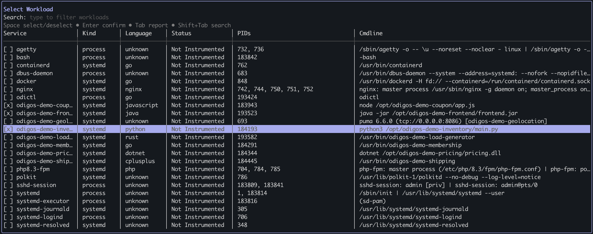
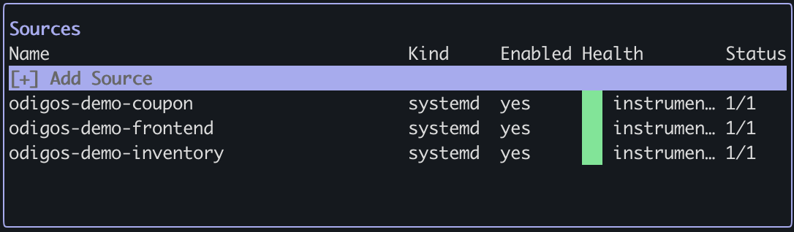

There are two ways to add [sources](/vmagent/overview#key-concepts) to the Odigos VM Agent: use `odictl` or use YAML files.

<Tip>It is recommended to [add a destination](/vmagent/setup/configuration/add-destinations) before adding a source.</Tip>

<Warning>
  **Instrumenting a source restarts its underlying service or process.** Regardless of whether you use `odictl` or YAML, the VM Agent restarts each service, process, or container when it applies instrumentation, so expect a brief interruption.

  **The only exception is Go and Java processes running directly on the host (not in a container).** These are instrumented in place and are **not** restarted.
</Warning>

<Tabs>
  <Tab title="odictl">
  <Steps>
    <Step title="Launch odictl">
      ```shell
      odictl
      ```
    </Step>
    <Step title="Open the Add Source menu">
      Use `Tab` to focus on the Sources pane or press `o`, then press `Enter` or click `+ Add Source` with your mouse.

      
    </Step>
  </Steps>

  Once the source list opens, choose how you want to instrument. Select a **single source** to review and adjust its
  properties before instrumenting, or select **multiple sources** to instrument them all at once with default settings.

  <Tabs>
    <Tab title="Single source">
      <Steps>
        <Step title="Search for and select a source">
          Click in the search bar at the top and type the name of the Linux process, and/or press `Tab` and scroll
          through the list of sources. Once your source is highlighted, press `Enter`.

          
        </Step>
        <Step title="Review properties and instrument">
          Review and adjust the properties if needed:

          <Expandable title="Properties">
            <ResponseField name="Name" type="string">
              The identity the VM Agent uses to match this source to the discovered process, service, or container. It is auto-populated at discovery time and is required — it also drives source lookup and log collection, so avoid changing it (contact support if you must).
            </ResponseField>
            <ResponseField name="Service Name" type="string">
              The OpenTelemetry `service.name` reported for this source's telemetry — the service that its spans, metrics, and logs are attributed to in your backend (for example, the service node in a service map). It is auto-populated from `Name` at discovery time, but you can edit it to report telemetry under a different service name. If left empty, it defaults to `Name`. This does not change process matching or the individual span (operation) names.
            </ResponseField>
            <ResponseField name="Kind" type="string">
              The process type: either `systemd` for services managed by systemd, `process` for standalone Linux processes, or `docker` for docker containers. 
              This field is auto-populated at discovery time — contact support before changing it.
            </ResponseField>
            <ResponseField name="Enabled" type="boolean">
              Controls whether the VM Agent instruments this source. Check to enable instrumentation, or uncheck to pause it without removing the source.
            </ResponseField>
            <ResponseField name="Runtime Language" type="string">
              The programming language of the process as detected by the VM Agent. This field is auto-populated at discovery time — contact support before changing it.
            </ResponseField>
            <ResponseField name="Runtime Version" type="string">
              The version of the runtime language as detected by the VM Agent. This field is auto-populated at discovery time — contact support before changing it.
            </ResponseField>
          </Expandable>
          <br />

          

          Press `Ctrl+S` to save and instrument your source.
        </Step>
        <Step title="Verify instrumentation">
          Instrumentation can take a few moments to complete. Once it is applied, the source appears in the `Sources` list with a green `Health` status.

          
        </Step>
      </Steps>
    </Tab>
    <Tab title="Multiple sources (defaults)">
      <Steps>
        <Step title="Select multiple sources">
          Move through the list with the arrow keys or `Tab`, and press `Space` to select each process, service, or
          container you want to instrument. Repeat until all the sources you want are selected.

          
        </Step>
        <Step title="Instrument all selected sources">
          Press `Enter` to instrument every selected source at once. This flow does not show the properties dialog —
          each source is instrumented with its default settings, which is what most deployments want.
        </Step>
        <Step title="Verify instrumentation">
          Instrumentation can take a few moments to complete. Once it is applied, the sources appear in the `Sources` list with a green `Health` status.

          
        </Step>
      </Steps>
    </Tab>
  </Tabs>
  </Tab>
  <Tab title="YAML">
    <Steps>
      <Step title="Navigate to the /etc/odigos-vmagent/sources.d folder">
    
        ```shell
        cd /etc/odigos-vmagent/sources.d
        ```

      </Step>
      <Step title="Create source YAML file">

        Create a YAML file for your source's configuration using the editor of your choice. The example below uses [vi](https://en.wikipedia.org/wiki/Vi).

        ```shell
        sudo vi example.yaml
        ```

      </Step>
      <Step title="Add the source configuration">

        Define each service or process you want to instrument using the properties below.

        <Expandable title="Properties">
          <ResponseField name="name" type="string">
            The identity the VM Agent uses to match this source to the discovered process, service, or container. Required, and also used for source lookup and log collection, so it should match the detected workload.
          </ResponseField>
          <ResponseField name="enabled" type="boolean">
            Controls whether the VM Agent instruments this source. Set to `true` to enable instrumentation, or to `false` to pause it without removing the source.
          </ResponseField>
          <ResponseField name="serviceName" type="string">
            Optional. The OpenTelemetry `service.name` reported for this source's telemetry — the service that its spans, metrics, and logs are attributed to in your backend. If omitted, it defaults to `name`. This does not change process matching or the individual span (operation) names.
          </ResponseField>
          <ResponseField name="kind" type="string">
            The process type: either `systemd` for services managed by systemd, `process` for standalone Linux processes, or `docker` for Docker containers.
          </ResponseField>
          <ResponseField name="config" type="object | null">
            Optional runtime configuration (e.g., language and version). Auto-populated at discovery time — contact support before changing this field.
          </ResponseField>
        </Expandable>

        For example:
        ```yaml
        # serviceName omitted: telemetry is reported under service.name = odigos-demo-frontend (the name)
        - name: odigos-demo-frontend
          enabled: true
          kind: systemd
          config: null
        # serviceName set: telemetry is reported under service.name = membership-service
        - name: odigos-demo-membership
          enabled: true
          serviceName: membership-service
          kind: systemd
          config: null
        ```

        <Note>You can define multiple sources in a single YAML file, and you can organize sources across multiple YAML files.</Note>
      </Step>
      <Step title="Save the file">
        
        ```shell
        :wq!
        ```

      </Step>
      <Step title="Verify the source has been instrumented">

      ```shell
      sudo journalctl -u odigos-vmagent | grep 'Successfully attached eBPF probes to process'
      ```

      ```
      Mar 10 20:14:35 ip-10-0-1-51 odigos-vmagent[4203]: time=2026-03-10T20:14:35.846Z level=INFO source=/go/src/github.com/keyval/odigos-vmagent/pkg/components/controller/instrumentor/ebpf_manager.go:179 msg="Successfully attached eBPF probes to process" pid=7251 service=odigos-demo-frontend
      Mar 10 20:21:42 ip-10-0-1-51 odigos-vmagent[4203]: time=2026-03-10T20:21:42.098Z level=INFO source=/go/src/github.com/keyval/odigos-vmagent/pkg/components/controller/instrumentor/ebpf_manager.go:179 msg="Successfully attached eBPF probes to process" pid=8308 service=odigos-demo-membership
      ```

      </Step>
    </Steps>
  </Tab>
</Tabs>
