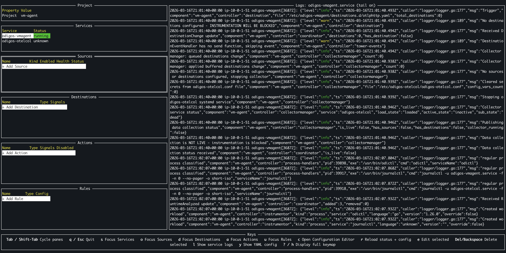
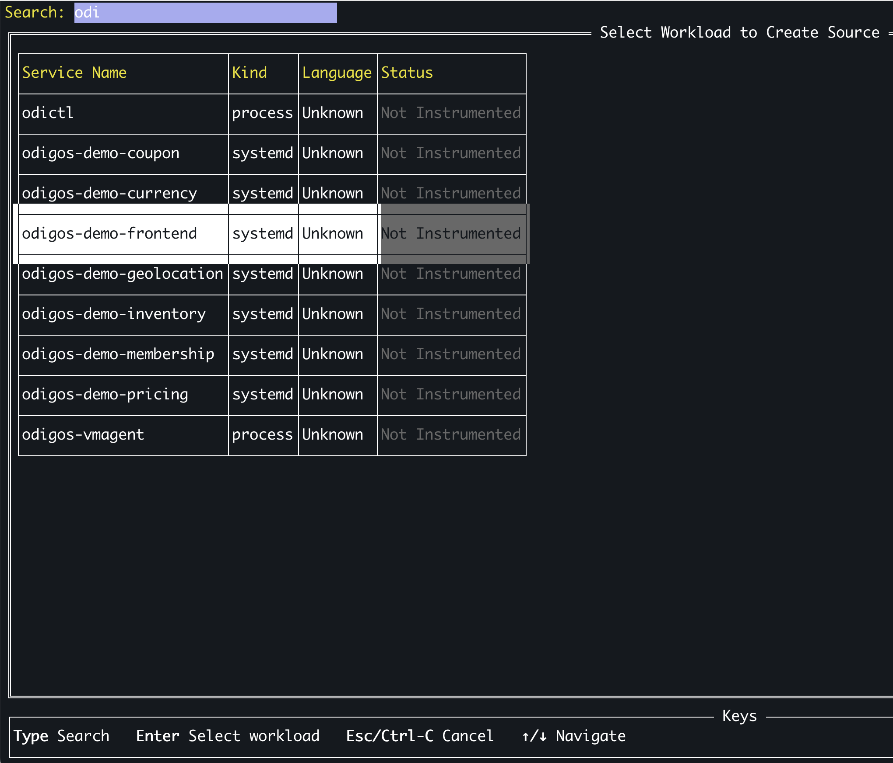
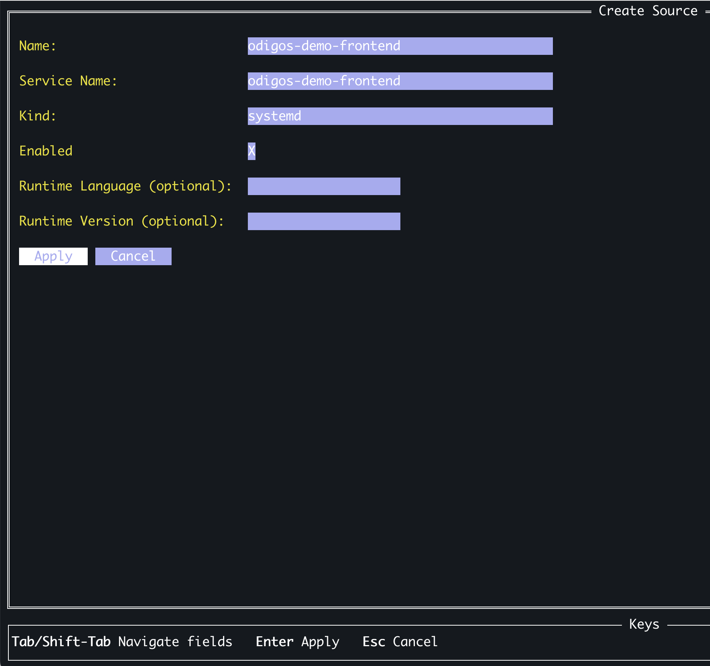
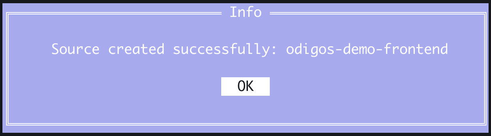
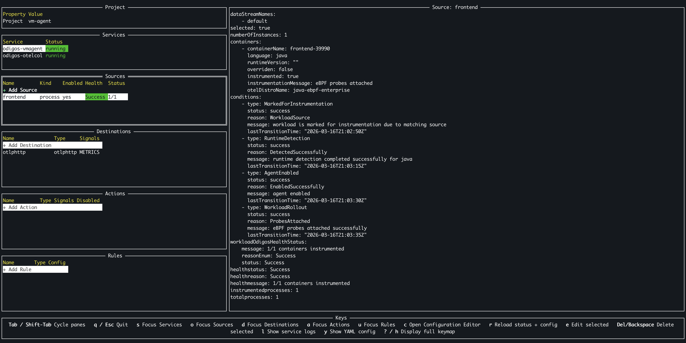

There are two ways to add [sources](../../../overview#key-concepts) to the Odigos VM Agent: use `odictl` or use YAML files.

<Tip>It is recommended to [add a destination](./add-destinations) before adding a source.</Tip>

<Tabs>
  <Tab title="odictl">
  <Steps>
    <Step title="Launch odictl">
      ```shell
      odictl
      ```
    </Step>
    <Step title="Select the source menu">
      Use `Tab` to focus on the Sources pane or press `o`, then press `Enter` or click `+ Add Source` with your mouse.

      
    </Step>
    <Step title="Select a source">
      Type the name of the Linux process in the search bar at the top, and/or press `Tab` and scroll through the list
      of sources. Once your source is highlighted, press `Enter`.

      
    </Step>
    <Step title="Instrument source">
      Review and adjust the properties if needed:
      
      <Expandable title="Properties">
        <ResponseField name="Name" type="string">
          A human-readable label for the process or systemd service. You can edit this to make the source easier to identify in the UI.
        </ResponseField>
        <ResponseField name="Service Name" type="string">
          The exact name of the running process as detected by the VM Agent. This field is auto-populated at discovery time — contact support before changing it.
        </ResponseField>
        <ResponseField name="Kind" type="string">
          The process type: either `systemd` for services managed by systemd, `process` for standalone Linux processes, or `docker` for docker containers. 
          This field is auto-populated at discovery time — contact support before changing it.
        </ResponseField>
        <ResponseField name="Enabled" type="boolean">
          Controls whether the VM Agent instruments this source. Check to enable instrumentation, or uncheck to pause it without removing the source.
        </ResponseField>
        <ResponseField name="Runtime Language" type="string">
          The programming language of the process as detected by the VM Agent. This field is auto-populated at discovery time — contact support before changing it.
        </ResponseField>
        <ResponseField name="Runtime Version" type="string">
          The version of the runtime language as detected by the VM Agent. This field is auto-populated at discovery time — contact support before changing it.
        </ResponseField>
      </Expandable>
      <br />

      

      Press `Tab` to navigate to `Apply`, then press `Enter` to save and instrument your service.

      <Warning>Once you select `Apply` the service or process will restart.</Warning> 
    </Step>
    <Step title="Complete instrumentation">

      Select `OK`.

      

      The service or process will restart automatically to apply instrumentation. After it comes back up, it appears in the `Sources` list with a `Health` status of `Success`.

      

    </Step>
  </Steps>
  </Tab>
  <Tab title="YAML">
    <Steps>
      <Step title="Navigate to the /etc/odigos-vmagent/sources.d folder">
    
        ```shell
        cd /etc/odigos-vmagent/sources.d
        ```

      </Step>
      <Step title="Create source YAML file">

        Create a YAML file for your source's configuration using the editor of your choice. The example below uses [vi](https://en.wikipedia.org/wiki/Vi).

        ```shell
        sudo vi example.yaml
        ```

      </Step>
      <Step title="Add the source configuration">

        Define each service or process you want to instrument using the properties below.

        <Expandable title="Properties">
          <ResponseField name="name" type="string">
            A human-readable label for the process or systemd service. You can edit this to make the source easier to identify in the UI.
          </ResponseField>
          <ResponseField name="enabled" type="boolean">
            Controls whether the VM Agent instruments this source. Set to `true` to enable instrumentation, or to `false` to pause it without removing the source.
          </ResponseField>
          <ResponseField name="serviceName" type="string">
            The exact name of the running process as detected by the VM Agent.
          </ResponseField>
          <ResponseField name="kind" type="string">
            The process type: either `systemd` for services managed by systemd, `process` for standalone Linux processes, or `docker` for Docker containers.
          </ResponseField>
          <ResponseField name="config" type="object | null">
            Optional runtime configuration (e.g., language and version). Auto-populated at discovery time — contact support before changing this field.
          </ResponseField>
        </Expandable>

        For example:
        ```yaml
        - name: odigos-demo-frontend
          enabled: true
          serviceName: odigos-demo-frontend
          kind: systemd
          config: null
        - name: odigos-demo-membership
          enabled: true
          serviceName: odigos-demo-membership
          kind: systemd
          config: null
        ```

        <Note>You can define multiple sources in a single YAML file, and you can organize sources across multiple YAML files.</Note>
      </Step>
      <Step title="Save the file">
        
        ```shell
        :wq!
        ```

      </Step>
      <Step title="Verify the source has been instrumented">

      ```shell
      sudo journalctl -u odigos-vmagent | grep 'Successfully attached eBPF probes to process'
      ```

      ```
      Mar 10 20:14:35 ip-10-0-1-51 odigos-vmagent[4203]: time=2026-03-10T20:14:35.846Z level=INFO source=/go/src/github.com/keyval/odigos-vmagent/pkg/components/controller/instrumentor/ebpf_manager.go:179 msg="Successfully attached eBPF probes to process" pid=7251 service=odigos-demo-frontend
      Mar 10 20:21:42 ip-10-0-1-51 odigos-vmagent[4203]: time=2026-03-10T20:21:42.098Z level=INFO source=/go/src/github.com/keyval/odigos-vmagent/pkg/components/controller/instrumentor/ebpf_manager.go:179 msg="Successfully attached eBPF probes to process" pid=8308 service=odigos-demo-membership
      ```

      </Step>
    </Steps>
  </Tab>
</Tabs>
