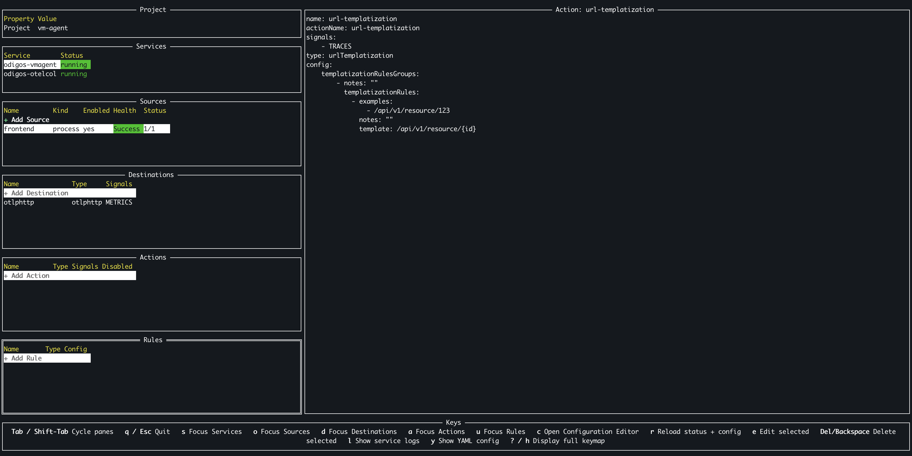
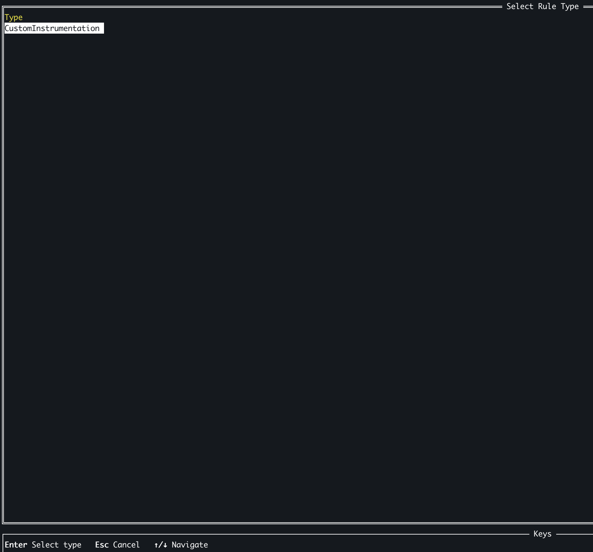
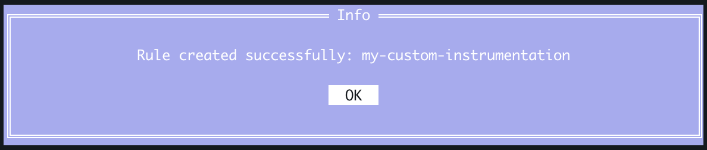
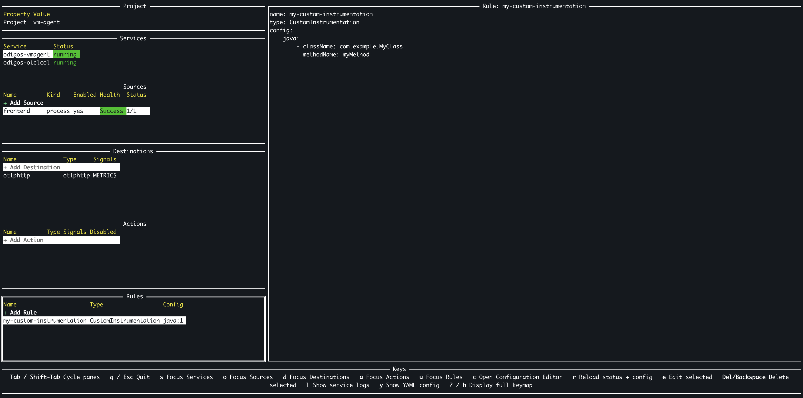

[Custom instrumentation](./overview#custom-instrumentation) lets you define custom eBPF-based instrumentations for specific functions or methods in your application or its dependencies. Unlike automatic instrumentation, which covers common frameworks and libraries, custom instrumentation targets the exact code you choose—for example, a business-critical function or an internal helper that you want to see as a span in your traces. The VM Agent supports **Java** and **Go**. For Go, you can instrument either a **function** (by package and function name) or a **receiver method** (by package, receiver type, and method name); you must use one form or the other, not both. 

There are two ways to add a custom instrumentation rule: using `odictl` or using YAML files.

<Tabs>
  <Tab title="odictl">
    <Steps>
      <Step title="Launch odictl">
        ```shell
        odictl
        ```
      </Step>
      <Step title="Open the Instrumentation Rules pane">
        Use `Tab` to cycle to the **Instrumentation Rules** pane, or click it with your mouse. Press `Enter` or click **+ Add Rule** to add a new rule.
        
      </Step>
      <Step title="Choose Custom instrumentation">
        Select **Custom instrumentation** as the rule type and press `Enter`.
        
      </Step>
      <Step title="Configure the rule">
        1. Press `i` to enter INSERT mode.
        2. For **Java**: set `class` (fully qualified class name) and `method` (method name).
        3. For **Go function**: set `packageName` and `functionName`. Do not set `receiverName` or `receiverMethodName`.
        4. For **Go receiver method**: set `packageName`, `receiverName`, and `receiverMethodName`. Do not set `functionName`.
        5. When finished, press `Esc`, then type `:wq` to save and exit.

        **Examples**

        <AccordionGroup>
          <Accordion title="Java">
            Instrument a method by fully qualified class and method name:
            ```yaml
            name: my-custom-instrumentation
            type: CustomInstrumentation
            config:
              java:
                - className: "com.example.MyClass"
                  methodName: "myMethod"
            ```
          </Accordion>
          <Accordion title="Go — function">
            Instrument a function by package and function name:
            ```yaml
            name: my-custom-instrumentation
            type: CustomInstrumentation
            config:
              golang:
                - packageName: "github.com/example/ecommerce"
                  functionName: "ProcessOrder"
            ```
          </Accordion>
          <Accordion title="Go — receiver method">
            Instrument a method by package, receiver type, and method name:
            ```yaml
            name: my-custom-instrumentation
            type: CustomInstrumentation
            config:
              golang:
                - packageName: "github.com/example/ecommerce"
                  receiverName: "OrderProcessor"
                  receiverMethodName: "ProcessOrder"
            ```
          </Accordion>
        </AccordionGroup>

        <Tip>The `java:` and `golang:` keys accept a list; add multiple entries to instrument several methods or functions in one rule. Use only one language per rule (do not combine java: and golang:). For Go, use either functions or receiver methods in a single rule, not both.</Tip>
        <Note>To cancel, press `Esc` if in INSERT mode, then type `:q!` to exit without saving.</Note>
      </Step>
      <Step title="Complete adding the rule">
        Select `OK`. The rule appears in the **Rules** section in `odictl`.
        
      </Step>
      <Step title="Verify the rule">
        The rule appears in the **Rules** list.
        
      </Step>
    </Steps>
  </Tab>
  <Tab title="YAML">
    <Steps>
      <Step title="Navigate to the rules configuration folder">
        ```shell
        cd /etc/odigos-vmagent/rules.d
        ```
      </Step>
      <Step title="Create a rule YAML file">
        Create a YAML file for your custom instrumentation rule. The example below uses [vi](https://en.wikipedia.org/wiki/Vi).

        ```shell
        sudo vi custom-instrumentation.yaml
        ```
      </Step>
      <Step title="Add the custom instrumentation configuration">
        Add a rule with `customInstrumentation` and either `golang` or `java`. For Go, use either a **function** (package + functionName) or a **receiver method** (package + receiverName + receiverMethodName), not both.

        <AccordionGroup>
            <Accordion title="Java — class and method">
            ```yaml
            name: custom-instrumentation
            type: CustomInstrumentation
            config:
              java:
                - className: "com.example.ecommerce.OrderService"
                  methodName: "processOrder"
            ```
          </Accordion>
          <Accordion title="Go — package and function">
            ```yaml
            name: custom-instrumentation
            type: CustomInstrumentation
            config:
              golang:
                - packageName: "github.com/example/ecommerce"
                  functionName: "ProcessOrder"
            ```
          </Accordion>
          <Accordion title="Go — receiver method">
            ```yaml
            name: custom-instrumentation
            type: CustomInstrumentation
            config:
              golang:
                - packageName: "github.com/example/ecommerce"
                  receiverName: "OrderProcessor"
                  receiverMethodName: "ProcessOrder"
            ```
          </Accordion>
        </AccordionGroup>
      </Step>
      <Step title="Save the file">
        ```shell
        :wq!
        ```
      </Step>
      <Step title="Verify the rule has been loaded">
        ```shell
        sudo journalctl -u odigos-vmagent | grep -i rules
        ```
        ```
        Mar 16 21:49:38 ip-10-0-1-51 odigos-vmagent[36872]: {"level":"info","ts":"2026-03-16T21:49:38.580Z","caller":"logger/logger.go:177","msg":"Publishing rules snapshot","component":"vm-agent","controller":"rules","files":4,"total_rules":4}
        Mar 16 21:49:38 ip-10-0-1-51 odigos-vmagent[36872]: {"level":"info","ts":"2026-03-16T21:49:38.580Z","caller":"logger/logger.go:177","msg":"Received RulesChange update","component":"vm-agent","controller":"coordinator","rules":4,"has_rules":true}
        ```
      </Step>
    </Steps>
  </Tab>
</Tabs>
