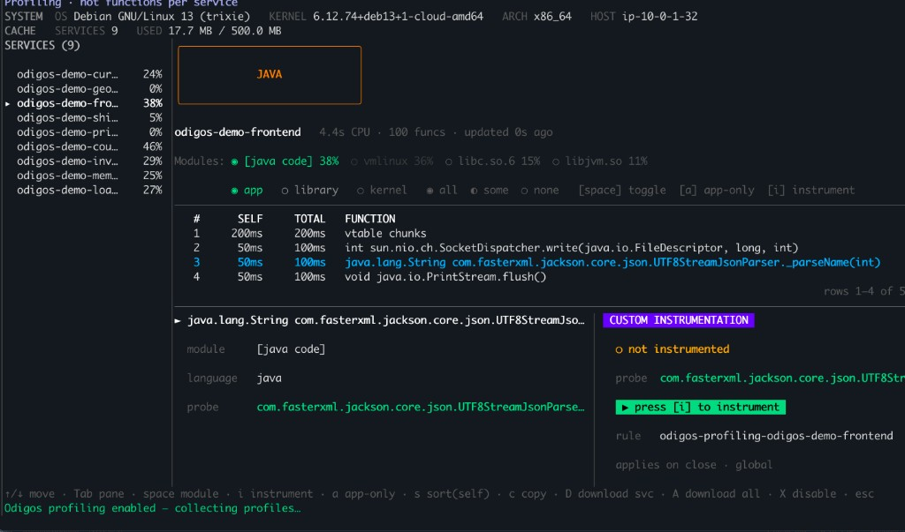
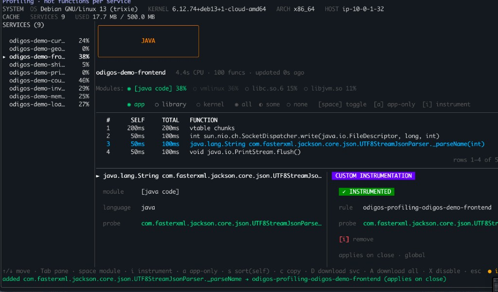
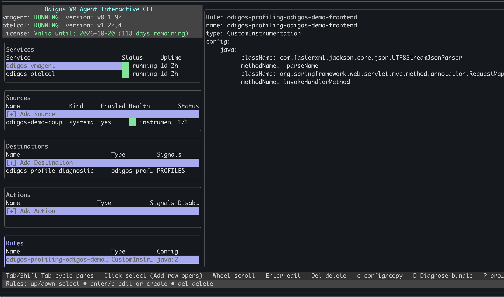

The odictl [profiling view](../../../instrumentations/profiling/view-in-odictl) lets you turn a profiled function into a [custom instrumentation](./custom-instrumentation) rule with a single keystroke. Instead of typing a class, package, or method name by hand, you highlight a hot function in the profile and press `i`—`odictl` generates the matching `CustomInstrumentation` rule for you.

This UI-driven flow supports **Java**, **Go**, and **C++**.

<Note>
This page covers the profile-driven, UI-only workflow. To define a rule manually (entering class/method or package/function yourself) or with YAML files, see [Custom Instrumentation](./custom-instrumentation).
</Note>

## Before you start

- Profiling must be enabled and collecting data. See [View profiles in odictl](../../../instrumentations/profiling/view-in-odictl).
- A [source](../add-sources) must be enabled for the service you want to instrument.

## Create a rule from a profile

<Steps>
  <Step title="Open the profiling view and select a function">
    From the main `odictl` dashboard, press <Badge color="blue">Shift+P</Badge> to open the [profiling view](../../../instrumentations/profiling/view-in-odictl). Use `Tab` to move between the three panes—**Services**, **Filter modules**, and **Functions**—and the arrow keys to move within the focused pane.

    1. In the **Services** pane, select a service. Its runtime (Java, Go, or C++) determines the modules shown.
    2. In the **Filter modules** pane, adjust the module or type filter if needed.
    3. In the **Functions** pane, highlight the function you want to instrument.

    In this example, the `odigos-demo-frontend` service is selected and the highlighted function is the Java method `com.fasterxml.jackson.core.json.UTF8StreamJsonParser._parseName`.

    
  </Step>
  <Step title="Instrument the function">
    Press <Badge color="blue">i</Badge>. The bottom-right panel updates to show the function is **Instrumented**. In this example, `_parseName` is now instrumented under the `odigos-profiling-odigos-demo-frontend` rule.

    
  </Step>
  <Step title="Return to the dashboard">
    Press <Badge color="blue">Esc</Badge> to return to the main dashboard. A new rule appears in the **Rules** section, named `odigos-profiling-<service-name>` for the service you selected—`odigos-profiling-odigos-demo-frontend` in this example.
  </Step>
  <Step title="Review the generated rule">
    Highlight the rule to view its configuration. The generated config matches the runtime of the profiled function:

    - **Java** — the fully qualified class name and method name.
    - **Go** — the package and function name, or the package, receiver type, and method name.
    - **C++** — the function signature.

    For the underlying field reference, see [Custom Instrumentation](./custom-instrumentation).

    

    <Note>
    The rule name and config are generated automatically from the profile—you don't enter the class, package, or method by hand. To author a rule manually instead, see [Custom Instrumentation](./custom-instrumentation).
    </Note>
  </Step>
  <Step title="Verify the new span">
    Once the rule is applied, new traces include a span for the instrumented function. Open your trace backend and search for the function name (for example, `_parseName`) to confirm the span is being recorded.
  </Step>
</Steps>

## Remove a profile-driven instrumentation

To stop instrumenting a function, reopen the profiling view (`Shift+P`), highlight the same function, and press <Badge color="blue">i</Badge> again. The panel shows **[i] remove** for an already-instrumented function.

## Related

- [View profiles in odictl](../../../instrumentations/profiling/view-in-odictl) — open and navigate the profiling view.
- [Custom Instrumentation](./custom-instrumentation) — define rules manually with `odictl` or YAML.
- [Instrumentation rules overview](./overview) — all rule types and their benefits.
