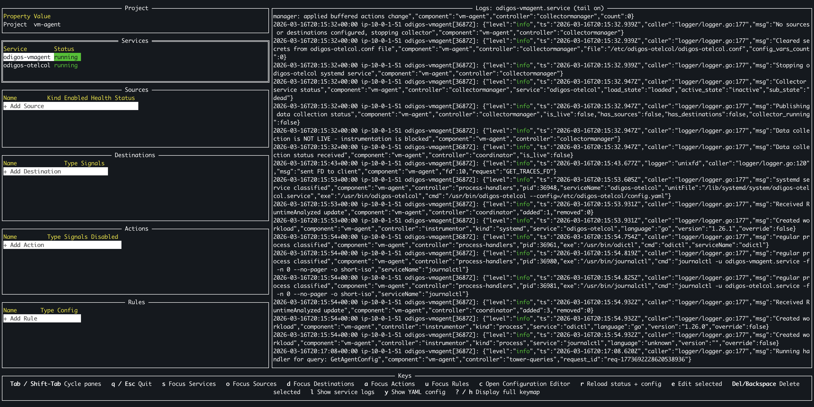
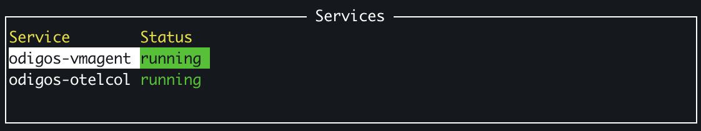
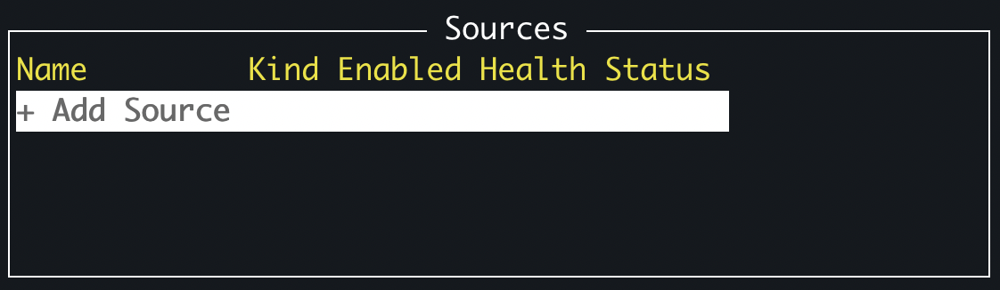
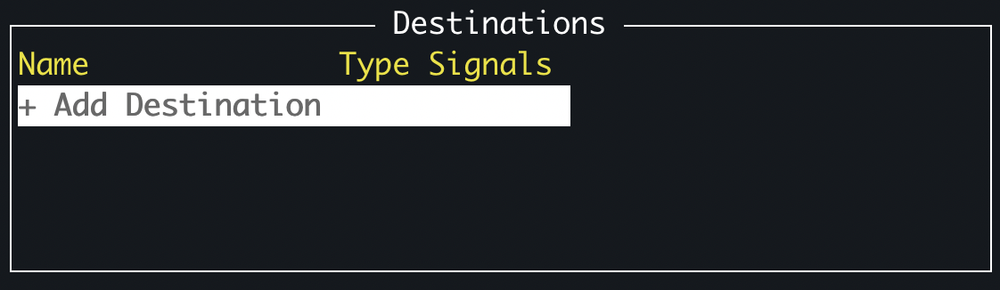
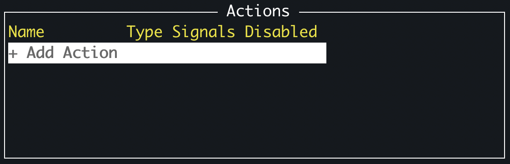
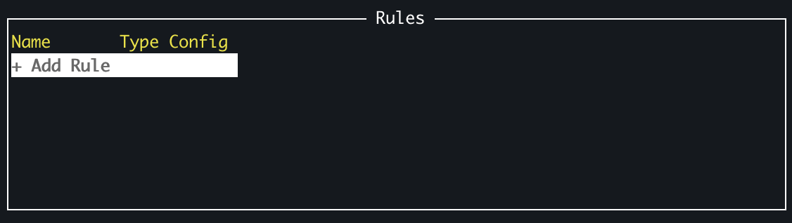

## Introduction

The Odigos VM Agent is installed with a terminal user interface (TUI) called `odictl`. `odictl` is one method you can use
to instrument processes and services, set up destinations, and add actions to Odigos.

To launch `odictl`, run the following command from the command-line:

```shell
odictl
```

You will then see a screen similar to the one below:



## Navigation

The odictl interface has five main sections: <Badge color="blue">Services</Badge>, <Badge color="blue">Logs</Badge>,
<Badge color="blue">Sources</Badge>, <Badge color="blue">Destinations</Badge>, and <Badge color="blue">Actions</Badge>.
Use the keyboard to move between them; if you are connected through an `ssh` session from a terminal that supports
mouse input, you can navigate the interface with your mouse.

## Navigating the Interface


<AccordionGroup>
<Accordion title="Keyboard Navigation" icon="keyboard" defaultOpen="false">

The following describes how to navigate using the keyboard:

| Key | Action |
|-----|--------|
| `Tab` / `Shift+Tab` | Cycle panes |
| `↑` / `↓` | Move between items in the current section |
| `Enter` | Select the highlighted item |
| `q` / `Esc` | Quit |
| `s` | Focus Services |
| `o` | Focus Sources |
| `d` | Focus Destinations |
| `a` | Focus Actions |
| `c` | Open Configuration Editor |
| `r` | Reload status + config |
| `e` | Edit selected |
| `Del` / `Backspace` | Delete selected |
| `l` | Show service logs |
| `y` | Show YAML config |
| `?` / `h` | Display full keymap |

<Tip>The currently selected item has a secondary border around it. Press `Enter` to select it.</Tip>

</Accordion>

<Accordion title="Mouse Navigation" icon="mouse" defaultOpen="false">

#### Requirements

Mouse support requires:

- A terminal emulator that supports mouse input
- An SSH session that forwards mouse events

<Tip>Most modern terminal emulators support mouse interaction automatically.</Tip>

To navigate:

- Click a **section** to switch sections
- Click an **item** to select it

</Accordion>
</AccordionGroup>

## Services Panel

The Services section shows the status of the two services that run the Odigos VM Agent:
<Badge color="blue">odigos-vmagent</Badge> and <Badge color="blue">odigos-otelcol</Badge>. When you highlight a service,
the log window shows that service's logs.



The following animation shows switching between viewing logs for <Badge color="blue">odigos-vmagent</Badge>
and <Badge color="blue">odigos-otelcol</Badge> in the Logs section.

<video
  autoPlay
  muted
  loop
  playsInline
  className="w-full aspect-video rounded-xl"
  src="../../../images/vmagent/odictl/odictl-services-video.mp4"
></video>

## Logs Panel

The Logs section shows a live stream of logs for the <Badge color="blue">odigos-vmagent</Badge> and
<Badge color="blue">odigos-otelcol</Badge> Odigos services. When the section is focused, use the ↑ / ↓ keys
or the mouse wheel to scroll through the logs.

## Sources Panel

Sources is where you define the systemd services or Linux processes on the host system that you want to instrument with
the Odigos VM Agent. See [Add Sources](./add-sources) to learn how.



## Destinations Panel

[Destinations](../../../../enterprise/backends-overview) are backends that accept data from the Odigos VM Agent.
Odigos lets you [add as many destinations](./add-destinations) as you like, enabling you to
execute different use cases such as:

- Using different backends for different types of OpenTelemetry signals
- Migrating from one backend to another
- Testing different backends for different OpenTelemetry use cases



## Actions Panel

Actions let you modify OpenTelemetry data from Odigos Sources before it is exported to your destinations. Odigos
implements actions using OpenTelemetry Collector processors—components that transform, filter, or enrich telemetry
before it is sent to your destinations.

See [Actions overview](./actions/overview) to add or edit actions. For action types and processor options, see
[Odigos Actions](../../../../enterprise/pipeline/actions/introduction).



## Instrumentation Rules Panel

Instrumentation Rules control how telemetry is recorded from your instrumented sources. A rule can be applied to
specific sources and instrumentation libraries, letting you control what attributes, headers, or payloads are collected
and how custom instrumentations behave.

For rule types and configuration options, see [Instrumentation rules overview](./instrumentation-rules/overview).

